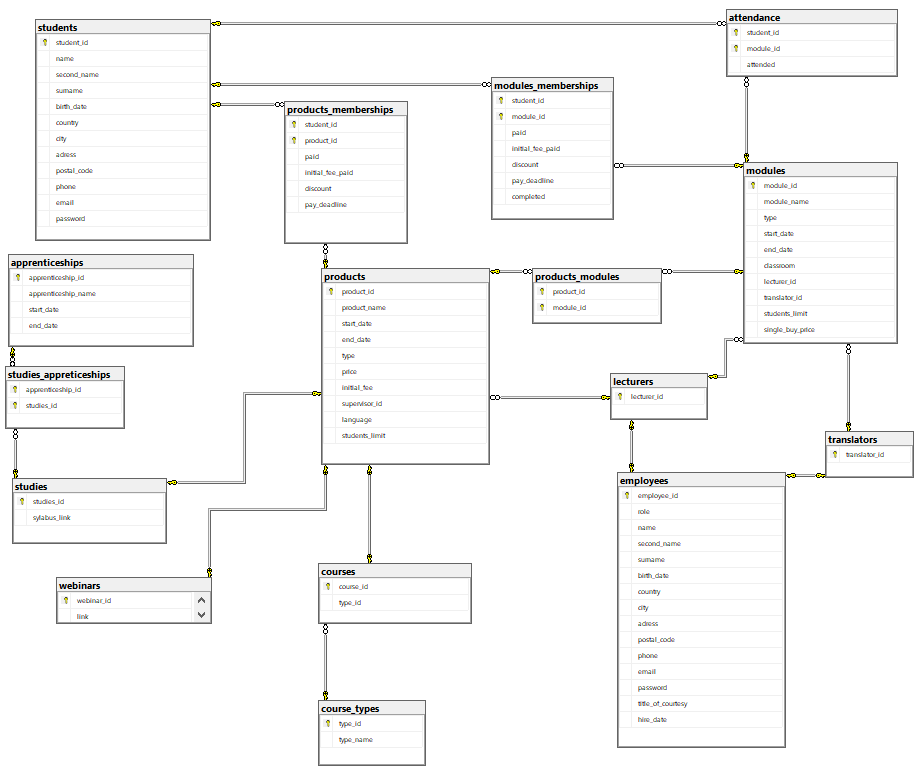

# PROJEKT PBD

## Zespół 8

Tomasz Żmuda, Konrad Konsek, Jakub Cieszewski

## 1. FUNKCJE REALIZOWANE PRZEZ SYSTEM

1. Użytkownik bez konta Użytkownik bez konta

- Zarejestrowanie konta

2. Użytkownik z kontem

- Zarządzanie koszykiem (dodaj produkt, usuń produkt, zapłać)

- Zapis na kurs/webinar/studia/praktyki

- Zalogowanie do systemu

- Podgląd dostępnych kursów/webinarów/studiów/praktyk

- Dostęp do historii swoich kursów

- Dostęp do harmonogramu

3. Wykładowca

- Zarządzanie listą uczestników w poszczególnych kursach

- Dostęp do informacji o kursach

- Dostęp do harmonogramu (dodawanie, usuwanie, edycja)

- Możliwość generowania raportów o nadchodzących wydarzeniach i raportów obecności na poszczególnych szkoleniach

4. Dyrektor

- Zarządzanie opłatami użytkowników (dodaj rabat, pokaż długi użytkowników, wyświetl raporty finansowe)

- Zarządzanie pracownikami (dodaj, usuń, edytuj, przypisz do kursu)

- Zarządzanie kursami (dodaj, usuń, edytuj)

- Zarządzanie praktykami (dodaj, usuń, edytuj, przypisz do studiów)

5. Pani z dziekanatu

- Dostęp do harmonogramu (dodawanie, usuwanie, edycja)

- Zarządzanie opłatami użytkowników (dodaj rabat, pokaż długi użytkowników, wyświetl raporty finansowe)

- Zarządzanie kursami (dodaj, usuń, edytuj)

- Zarządzanie praktykami (dodaj, usuń, edytuj, przypisz do studiów)

<div style="page-break-after: always;"></div>

## 2. Diagram bazy danych



<div style="page-break-after: always;"></div>

## 3. Opis tabel

1. Tabela “students”

Ogólne informacje o studentach: imię, nazwisko, adres, numer telefonu, adres mailowy oraz hasło do konta.

- student_id - numer id studenta (PK)
- name - imię studenta
- second name - drugie imię studenta
- surname - nazwisko studenta
- birth_date - data urodzenia studenta
- country - kraj zamieszkania studenta
- city - miasto zamieszkania studenta
- adress - adres zamieszkania studenta: ulica i numer mieszkania
- postal_code - kod pocztowy studenta
- phone - numer telefonu studenta
- email - adres email studenta
- password - hasło studenta

```sql
CREATE TABLE [dbo].[students](
	[student_id] [int] NOT NULL,
	[name] [varchar](50) NOT NULL,
	[second_name] [varchar](50) NULL,
	[surname] [varchar](50) NOT NULL,
	[birth_date] [date] NOT NULL,
	[country] [varchar](50) NOT NULL,
	[city] [varchar](50) NOT NULL,
	[adress] [varchar](50) NOT NULL,
	[postal_code] [varchar](50) NULL,
	[phone] [varchar](50) NOT NULL,
	[email] [varchar](50) NOT NULL,
	[password] [varchar](60) NOT NULL,
 CONSTRAINT [PK_students] PRIMARY KEY CLUSTERED
(
	[student_id] ASC
)
) ON [PRIMARY]
```

<div style="page-break-after: always;"></div>

2. Tabela “employees”

Ogólne informacje o pracownikach: imię, nazwisko, tytuł, rola w firmie, numer telefonu, adres mailowy oraz hasło do konta.

- employee_id - numer id pracownika (PK)
- role - rola w firmie pracownika
- name - imię pracownika
- second_name - drugie imię pracownika
- surname - nazwisko pracownika
- birth_date - data urodzenia pracownika
- country - kraj zamieszkania pracownika
- city - miasto zamieszkania pracownika
- adress - adres pracownika: ulica i numer miezkania
- postal_code - kod pocztowy pracownika
- phone - numer telefonu pracownika
- email - adres email pracownika
- password - hasło pracownika
- title_of_courtesy - tytuł pracownika
- hire_date - data zatrudnienia pracownika

```sql
CREATE TABLE [dbo].[employees](
	[employee_id] [int] NOT NULL,
	[role] [varchar](50) NOT NULL,
	[name] [varchar](50) NOT NULL,
	[second_name] [varchar](50) NULL,
	[surname] [varchar](50) NOT NULL,
	[birth_date] [date] NOT NULL,
	[country] [varchar](50) NOT NULL,
	[city] [varchar](50) NOT NULL,
	[adress] [varchar](50) NOT NULL,
	[postal_code] [varchar](50) NOT NULL,
	[phone] [varchar](50) NOT NULL,
	[email] [varchar](50) NOT NULL,
	[password] [varchar](50) NOT NULL,
	[title_of_courtesy] [varchar](10) NOT NULL,
	[hire_date] [date] NOT NULL,
 CONSTRAINT [PK_employees] PRIMARY KEY CLUSTERED
(
	[employee_id] ASC
)
) ON [PRIMARY]
```

<div style="page-break-after: always;"></div>

3. Tabela “products”

Informacje o dostępnych produktach (webinary, kursy, studia). 
Typ produktu, nazwa produktu, data rozpoczęcia i zakończenia, cena, zaliczka, opiekun, język prowadzenia, limit miejsc.

- product_id - numer id produktu (PK)
- product_name - nazwa produktu
- start_date - data rozpoczęcia dla produktu
- end_date - data zakończenia dla produktu
- type - typ produktu: webinar, kurs lub studia
- price - cena produktu
- initial_fee - zaliczka
- supervisor_id - numer id opiekuna produktu (FK)
- language - język w którym produkt jest prowadzony
- students_limit - limit studentów na kursie, o ile istnieje

```sql
CREATE TABLE [dbo].[products](
	[product_id] [int] NOT NULL,
	[product_name] [varchar](50) NOT NULL,
	[start_date] [datetime] NOT NULL,
	[end_date] [datetime] NOT NULL,
	[type] [varchar](50) NOT NULL,
	[price] [float] NOT NULL,
	[initial_fee] [float] NOT NULL,
	[supervisor_id] [int] NOT NULL,
	[language] [varchar](50) NOT NULL,
	[students_limit] [int] NULL,
 CONSTRAINT [PK_products] PRIMARY KEY CLUSTERED
(
	[product_id] ASC
)
) ON [PRIMARY]
GO

ALTER TABLE [dbo].[products]  WITH CHECK ADD
CONSTRAINT [FK_products_lecturers] FOREIGN KEY([supervisor_id])
REFERENCES [dbo].[lecturers] ([lecturer_id])
GO

ALTER TABLE [dbo].[products] CHECK
CONSTRAINT [FK_products_lecturers]
GO
```

<div style="page-break-after: always;"></div>

4. Tabela “modules”

Informację o modułach: nazwa, typ(kurs, webinar, studium), sala lekcyjna, id prowadzącego moduł, id ewentualnego tłumacza, limit miejsc, cena dla osób spoza kursu, data rozpoczęcia i zakończenia.
Jako moduł traktowana jest każda jednostka taka jak wykład, ćwiczenia, dzień kursu, webinar.

- module_id - numer id modułu (PK)
- module_name - nazwa modułu
- type - typ prowadzenia modułu: online, stacjonarnie etc.
- start_date - data rozpoczęcia modułu
- end_date - data zakończenia modułu
- classroom - numer klasy lub link do spotkania online
- lecturer_id - numer id prowadzącego (FK)
- translator_id - numer id tłumacza, o ile taki jest (FK)
- students_limit - limit studentów na module, o ile istnieje
- single_buy_price - cena zakupu pojedynczego modułu

```sql
CREATE TABLE [dbo].[modules](
	[module_id] [int] NOT NULL,
	[module_name] [varchar](50) NOT NULL,
	[type] [varchar](50) NOT NULL,
	[start_date] [datetime] NOT NULL,
	[end_date] [datetime] NOT NULL,
	[classroom] [varchar](50) NOT NULL,
	[lecturer_id] [int] NOT NULL,
	[translator_id] [int] NULL,
	[students_limit] [int] NULL,
	[single_buy_price] [float] NOT NULL,
 CONSTRAINT [PK_modules_1] PRIMARY KEY CLUSTERED
(
	[module_id] ASC
)
) ON [PRIMARY]
GO

ALTER TABLE [dbo].[modules]  WITH CHECK ADD
CONSTRAINT [FK_modules_lecturers] FOREIGN KEY([lecturer_id])
REFERENCES [dbo].[lecturers] ([lecturer_id])
GO

ALTER TABLE [dbo].[modules] CHECK
CONSTRAINT [FK_modules_lecturers]
GO

ALTER TABLE [dbo].[modules]  WITH CHECK ADD
CONSTRAINT [FK_modules_translators] FOREIGN KEY([translator_id])
REFERENCES [dbo].[translators] ([translator_id])
GO

ALTER TABLE [dbo].[modules] CHECK
CONSTRAINT [FK_modules_translators]
GO
```

<div style="page-break-after: always;"></div>

5. Tabela “products_modules”

Tabela służąca do przyporządkowania modułów do studiów.

- module_id - numer id modułu (PK)
- product_id - numer id produktu (PK)

```sql
CREATE TABLE [dbo].[products_modules](
	[product_id] [int] NOT NULL,
	[module_id] [int] NOT NULL,
 CONSTRAINT [PK_products_modules_1] PRIMARY KEY CLUSTERED
(
	[product_id] ASC,
	[module_id] ASC
)
) ON [PRIMARY]
GO

ALTER TABLE [dbo].[products_modules]  WITH CHECK ADD
CONSTRAINT [FK_products_modules_modules] FOREIGN KEY([module_id])
REFERENCES [dbo].[modules] ([module_id])
GO

ALTER TABLE [dbo].[products_modules] CHECK
CONSTRAINT [FK_products_modules_modules]
GO

ALTER TABLE [dbo].[products_modules]  WITH CHECK ADD
CONSTRAINT [FK_products_modules_products] FOREIGN KEY([product_id])
REFERENCES [dbo].[products] ([product_id])
GO

ALTER TABLE [dbo].[products_modules] CHECK
CONSTRAINT [FK_products_modules_products]
GO
```

<div style="page-break-after: always;"></div>

6. Tabela “courses”

Informacja o typie kursu – stacjonarny/online synchroniczny/online asynchroniczny/hybrydowy.

- course_id - numer kursu (PK)
- type - typ prowadzenia kursu

```sql
CREATE TABLE [dbo].[courses](
	[course_id] [int] NOT NULL,
	[type_id] [int] NOT NULL,
 CONSTRAINT [PK_courses] PRIMARY KEY CLUSTERED
(
	[course_id] ASC
)
) ON [PRIMARY]
GO

ALTER TABLE [dbo].[courses]  WITH CHECK ADD
CONSTRAINT [FK_courses_course_types] FOREIGN KEY([type_id])
REFERENCES [dbo].[course_types] ([type_id])
GO

ALTER TABLE [dbo].[courses] CHECK
CONSTRAINT [FK_courses_course_types]
GO

ALTER TABLE [dbo].[courses]  WITH CHECK ADD
CONSTRAINT [FK_courses_products] FOREIGN KEY([course_id])
REFERENCES [dbo].[products] ([product_id])
GO

ALTER TABLE [dbo].[courses] CHECK
CONSTRAINT [FK_courses_products]
GO
```

<div style="page-break-after: always;"></div>

7. Tabela “webinars”

Zawiera linki do webinarów.

- webinar_id - numer id webinaru (PK)
- link - link do pokoju online w którym odbędzie się webinar

```sql
CREATE TABLE [dbo].[webinars](
	[webinar_id] [int] NOT NULL,
	[link] [varchar](100) NOT NULL,
 CONSTRAINT [PK_webinars] PRIMARY KEY CLUSTERED
(
	[webinar_id] ASC
)
) ON [PRIMARY]
GO

ALTER TABLE [dbo].[webinars]  WITH CHECK ADD
CONSTRAINT [FK_webinars_products] FOREIGN KEY([webinar_id])
REFERENCES [dbo].[products] ([product_id])
GO

ALTER TABLE [dbo].[webinars] CHECK
CONSTRAINT [FK_webinars_products]
GO
```

<div style="page-break-after: always;"></div>

8. Tabela “studies”

Zawiera linki do sylabusa studiów.

- studies_id - numer id studiów (PK)
- syllabus_link - link do syllabus’u studiów

```sql
CREATE TABLE [dbo].[studies](
	[studies_id] [int] NOT NULL,
	[sylabus_link] [varchar](100) NOT NULL,
 CONSTRAINT [PK_studies] PRIMARY KEY CLUSTERED
(
	[studies_id] ASC
)
) ON [PRIMARY]
GO

ALTER TABLE [dbo].[studies]  WITH CHECK ADD
CONSTRAINT [FK_studies_products] FOREIGN KEY([studies_id])
REFERENCES [dbo].[products] ([product_id])
GO

ALTER TABLE [dbo].[studies] CHECK
CONSTRAINT [FK_studies_products]
GO
```

<div style="page-break-after: always;"></div>

9. Tabela “apprenticeships”

Informację o praktykach: nazwa, data rozpoczęcia i zakończenia

- apprenticeship_id - numer id praktyk (PK)
- apprenticeship_name - nazwa praktyk
- start_date - data rozpoczęcia praktyk
- end_date - data zakończenia praktyk

```sql
CREATE TABLE [dbo].[apprenticeships](
	[apprenticeship_id] [int] NOT NULL,
	[apprenticeship_name] [varchar](50) NULL,
	[start_date] [datetime] NULL,
	[end_date] [datetime] NULL,
 CONSTRAINT [PK_apprenticeships] PRIMARY KEY CLUSTERED
(
	[apprenticeship_id] ASC
)
) ON [PRIMARY]
GO
```

<div style="page-break-after: always;"></div>

10. Tabela “studies_apprenticeships”

Tabela służąca do przyporządkowania praktyk do studiów

- apprenticeship_id - numer id praktyk (PK)
- studies_id - numer id studiów (PK)

```sql
CREATE TABLE [dbo].[studies_appreticeships](
	[apprenticeship_id] [int] NOT NULL,
	[studies_id] [int] NOT NULL,
 CONSTRAINT [PK_studies_appreticeships_1] PRIMARY KEY CLUSTERED
(
	[apprenticeship_id] ASC,
	[studies_id] ASC
)
) ON [PRIMARY]
GO

ALTER TABLE [dbo].[studies_appreticeships]  WITH CHECK ADD
CONSTRAINT [FK_studies_appreticeships_apprenticeships] FOREIGN KEY([apprenticeship_id])
REFERENCES [dbo].[apprenticeships] ([apprenticeship_id])
GO

ALTER TABLE [dbo].[studies_appreticeships] CHECK
CONSTRAINT [FK_studies_appreticeships_apprenticeships]
GO

ALTER TABLE [dbo].[studies_appreticeships]  WITH CHECK ADD
CONSTRAINT [FK_studies_appreticeships_studies] FOREIGN KEY([studies_id])
REFERENCES [dbo].[studies] ([studies_id])
GO

ALTER TABLE [dbo].[studies_appreticeships] CHECK
CONSTRAINT [FK_studies_appreticeships_studies]
GO
```

<div style="page-break-after: always;"></div>

11. Tabela “modules_memberships”

Tabela służąca do przechowywania modułów posiadanych przez studentów, w tym tych jeszcze nie opłaconych

- student_id - numer id studenta do którego należy moduł (PK)
- module_id - numer id modułu (PK)
- paid - informacja czy opłata za moduł została wpłacona
- initial_fee_paid - informacja czy zaliczka za moduł została wpłacona
- discount - zniżka
- pay_deadline - data do której trzeba wpłacić opłatę za moduł
- completed - informacja czy moduł został zaliczony

```sql
CREATE TABLE [dbo].[modules_memberships](
	[student_id] [int] NOT NULL,
	[module_id] [int] NOT NULL,
	[paid] [bit] NOT NULL,
	[initial_fee_paid] [bit] NOT NULL,
	[discount] [float] NOT NULL,
	[pay_deadline] [datetime] NOT NULL,
	[completed] [bit] NOT NULL,
 CONSTRAINT [PK_shopping_cart_1] PRIMARY KEY CLUSTERED
(
	[student_id] ASC,
	[module_id] ASC
)) ON [PRIMARY]
GO

ALTER TABLE [dbo].[modules_memberships]  WITH CHECK ADD
CONSTRAINT [FK_modules_memberships_modules] FOREIGN KEY([module_id])
REFERENCES [dbo].[modules] ([module_id])
GO

ALTER TABLE [dbo].[modules_memberships] CHECK
CONSTRAINT [FK_modules_memberships_modules]
GO

ALTER TABLE [dbo].[modules_memberships]  WITH CHECK ADD
CONSTRAINT [FK_shopping_cart_students] FOREIGN KEY([student_id])
REFERENCES [dbo].[students] ([student_id])
GO

ALTER TABLE [dbo].[modules_memberships] CHECK
CONSTRAINT [FK_shopping_cart_students]
GO
```

<div style="page-break-after: always;"></div>

12. Tabela “attendance”

Tabela przechowująca informację o obecności studentów na modułach.

- student_id - numer id studenta (PK)
- module_id - numer id modułu (PK)
- attended - informacja o tym czy student był obecny na module

```sql
CREATE TABLE [dbo].[attendance](
	[student_id] [int] NOT NULL,
	[module_id] [int] NOT NULL,
	[attended] [bit] NOT NULL,
 CONSTRAINT [PK_attendance_1] PRIMARY KEY CLUSTERED
(
	[student_id] ASC,
	[module_id] ASC
)
) ON [PRIMARY]
GO

ALTER TABLE [dbo].[attendance]  WITH CHECK ADD
CONSTRAINT [FK_attendance_modules] FOREIGN KEY([module_id])
REFERENCES [dbo].[modules] ([module_id])
GO

ALTER TABLE [dbo].[attendance] CHECK
CONSTRAINT [FK_attendance_modules]
GO

ALTER TABLE [dbo].[attendance]  WITH CHECK ADD
CONSTRAINT [FK_attendance_students] FOREIGN KEY([student_id])
REFERENCES [dbo].[students] ([student_id])
GO

ALTER TABLE [dbo].[attendance] CHECK
CONSTRAINT [FK_attendance_students]
GO

```

<div style="page-break-after: always;"></div>

13. Tabela “products_memberships”

Tabela służąca do przechowywania produktów posiadanych przez studentów, w tym tych jeszcze nie opłaconych

- student_id - numer id studenta do którego należy moduł (PK)
- product_id - numer id produktu (PK)
- paid - informacja czy opłata za produkt została wpłacona
- initial_fee_paid - informacja czy zaliczka za produkt została wpłacona
- discount - zniżka
- pay_deadline - data do której trzeba wpłacić opłatę za produkt

```sql
CREATE TABLE [dbo].[products_memberships](
	[student_id] [int] NOT NULL,
	[product_id] [int] NOT NULL,
	[paid] [bit] NOT NULL,
	[initial_fee_paid] [bit] NOT NULL,
	[discount] [float] NOT NULL,
	[pay_deadline] [datetime] NOT NULL,
 CONSTRAINT [PK_memberships_1] PRIMARY KEY CLUSTERED
(
	[student_id] ASC,
	[product_id] ASC
)) ON [PRIMARY]
GO

ALTER TABLE [dbo].[products_memberships]  WITH CHECK ADD
CONSTRAINT [FK_memberships_students] FOREIGN KEY([student_id])
REFERENCES [dbo].[students] ([student_id])
GO

ALTER TABLE [dbo].[products_memberships] CHECK
CONSTRAINT [FK_memberships_students]
GO

ALTER TABLE [dbo].[products_memberships]  WITH CHECK ADD
CONSTRAINT [FK_products_memberships_products] FOREIGN KEY([product_id])
REFERENCES [dbo].[products] ([product_id])
GO

ALTER TABLE [dbo].[products_memberships] CHECK
CONSTRAINT [FK_products_memberships_products]
GO
```

<div style="page-break-after: always;"></div>

14. Tabela "translators"

Tabela przechowująca identyfikatory tłumaczów

- translator_id - numer id tłumacza (PK)

```sql
CREATE TABLE [dbo].[translators](
	[translator_id] [int] NOT NULL,
 CONSTRAINT [PK_translators] PRIMARY KEY CLUSTERED
(
	[translator_id] ASC
)
) ON [PRIMARY]
GO

ALTER TABLE [dbo].[translators]  WITH CHECK ADD
CONSTRAINT [FK_translators_employees] FOREIGN KEY([translator_id])
REFERENCES [dbo].[employees] ([employee_id])
GO

ALTER TABLE [dbo].[translators] CHECK
CONSTRAINT [FK_translators_employees]
GO

```

<div style="page-break-after: always;"></div>

15. Tabela "lecturers"

Tabela przechowująca identyfikatory wykładowców

- lecturer_id - numer id wykładowcy (PK)

```sql
CREATE TABLE [dbo].[lecturers](
	[lecturer_id] [int] NOT NULL,
 CONSTRAINT [PK_lecturers] PRIMARY KEY CLUSTERED
(
	[lecturer_id] ASC
)
) ON [PRIMARY]
GO

ALTER TABLE [dbo].[lecturers]  WITH CHECK ADD
CONSTRAINT [FK_lecturers_employees] FOREIGN KEY([lecturer_id])
REFERENCES [dbo].[employees] ([employee_id])
GO

ALTER TABLE [dbo].[lecturers] CHECK
CONSTRAINT [FK_lecturers_employees]
GO
```

# Widoki

1. Widok showAllModules
   
Wyświetla wszystkie moduły z wszystkimi informacjami

```sql
CREATE VIEW [dbo].[showAllModules]
AS
    SELECT module_id, module_name, type, start_date, end_date,
        classroom, lecturer_id, translator_id, students_limit, single_buy_price
    FROM     dbo.modules
GO
```

2. Widok showNotStartedModules

Wyświetla moduły które jeszcze się nie zaczęły

```sql
CREATE VIEW [dbo].[showNotStartedModules]
AS
    SELECT module_id, module_name, type, start_date,
        end_date, classroom, lecturer_id, translator_id,
        students_limit, single_buy_price
    FROM dbo.modules
    WHERE  (start_date > GETDATE())
GO
```

3. Widok showNotStartedProducts

Wyświetla produkty które jescze się nie zaczęły

```sql
CREATE VIEW [dbo].[showNotStartedProducts]
AS
    SELECT product_id, product_name, start_date, end_date,
        type, price, initial_fee, supervisor_id, language,
        students_limit
    FROM dbo.products
WHERE  (start_date > GETDATE())
GO
```

4. Widok showAllWebinars

Wyświetla wszystkie webinaria

```sql
create view [dbo].[showAllWebinars] as
select product_name
from products
where type = 'webinar'
GO
```

5. Widok showAllCourses

Wyświetla wszyste dostępne produkty

```sql
create view [dbo].[showAllCourses] as
select product_name
from products
where type = 'course'
GO
```

6. Widok showAllStudentsWithModuleDebt

Wyświetla wszystkich studentów, którzy zalegają z opłatami za moduły

```sql
CREATE VIEW [dbo].[showAllStudentsWithModuleDebt]
AS
SELECT DISTINCT s.name, s.surname
FROM            dbo.modules_memberships AS mm INNER JOIN
                         dbo.students AS s ON mm.student_id = s.student_id AND mm.paid = 0
GO

```

7. Widok showAllStudentsWithProductDebt

Wyświetla wszystkich studentów, którzy zalegają z opłatami za produkty

```sql
CREATE VIEW [dbo].[showAllStudentsWithProductDebt]
AS
SELECT DISTINCT s.name, s.surname
FROM            dbo.products_memberships AS pm INNER JOIN
                         dbo.students AS s ON pm.student_id = s.student_id AND pm.paid = 0
GO
```

# Procedures

1. Procedura changeStudentContactInfo
   
Zmienia wszystkie dane kontaktowe studenta

```sql
CREATE PROCEDURE [dbo].[changeStudentContactInfo]
	@id int,
	@country varchar(50),
	@city varchar(50),
	@adress varchar(50),
	@postal_code varchar(50),
	@phone varchar(50),
	@email varchar(50)
AS
BEGIN
	SET NOCOUNT ON;
	BEGIN TRY
		BEGIN
			UPDATE students
				SET country = @country, city = @city,
                                    adress = @adress, postal_code = @postal_code,
                                    phone = @phone, email = @email
				where student_id = @id
		END
	END TRY
	BEGIN CATCH
		DECLARE @msg nvarchar(2048)
			=N'Błąd aktualizowania danych: ' + ERROR_MESSAGE();
		THROW 52000, @msg, 1
	END CATCH
END
GO
```

2. Procedura changeAttendance
   
Zmienia status obecności studenta na danym module na obecny

```sql
CREATE PROCEDURE [dbo].[changeAttendance]
	@student_id int,
	@module_id int
AS
BEGIN
	SET NOCOUNT ON;
	BEGIN TRY
		BEGIN
			UPDATE attendance
				set attended = 1
				where student_id = @student_id and
                                    module_id = @module_id
		END
	END TRY
	BEGIN CATCH
		DECLARE @msg nvarchar(2048)
			=N'Błąd z wpisywaniem obecności: ' + ERROR_MESSAGE();
		THROW 52000, @msg, 1
	END CATCH
END
GO
```

3. Procedura changeEmployeeContactInfo
   
Zmienia danek konraktowe pracowników

```sql
CREATE PROCEDURE [dbo].[changeEmployeeContactInfo]
	@id int,
	@country varchar(50),
	@city varchar(50),
	@adress varchar(50),
	@postal_code varchar(50),
	@phone varchar(50),
	@email varchar(50)
AS
BEGIN
	SET NOCOUNT ON;
	BEGIN TRY
		BEGIN
			UPDATE employees
				set country = @country, city = @city,
                                    adress = @adress, postal_code = @postal_code,
                                    phone = @phone, email = @email
				where employee_id = @id
		END
	END TRY
	BEGIN CATCH
		DECLARE @msg nvarchar(2048)
			=N'Błąd zmiany danych kontaktowych: ' + ERROR_MESSAGE();
		THROW 52000, @msg, 1
	END CATCH
END
GO
```

4. Procedura changeExamToPassed
   
Ustawia status zaliczenia danego egzaminu na zaliczony

```sql
CREATE PROCEDURE [dbo].[changeExamToPassed]
	@student_id int,
	@studies_id int
AS
BEGIN
	SET NOCOUNT ON;
	BEGIN TRY
		BEGIN
			UPDATE studies_exam
				set passed = 1
				where student_id = @student_id and
                                    studies_id = @studies_id
		END
	END TRY
	BEGIN CATCH
		DECLARE @msg nvarchar(2048)
			=N'Błąd z zaliczaniem egzaminu: ' + ERROR_MESSAGE();
		THROW 52000, @msg, 1
	END CATCH
END
GO
```

5. Procedura changeModulePaidStatus
   
Zmienia status płatności dla modułu i studenta

```sql
CREATE PROCEDURE [dbo].[changeModulePaidStatus]
	@student_id int,
	@module_id int,
	@initial_fee_paid_status bit,
	@normal_price_paid_status bit
AS
BEGIN
	SET NOCOUNT ON;
	BEGIN TRY
		BEGIN
			UPDATE modules_memberships
				set initial_fee_paid = @initial_fee_paid_status,
                                    paid = @normal_price_paid_status
				where student_id = @student_id and
                                    module_id = @module_id
		END
	END TRY
	BEGIN CATCH
		DECLARE @msg nvarchar(2048)
			=N'Błąd z wpisywaniem statusu płatności: ' + ERROR_MESSAGE();
		THROW 52000, @msg, 1
	END CATCH
END
GO
```

6. Procedura changeProductPaidStatus
   
Zmienia status płatności dla danego produktu i studenta

```sql
CREATE PROCEDURE [dbo].[changeProductPaidStatus]
	@student_id int,
	@product_id int,
	@initial_fee_paid_status bit,
	@normal_price_paid_status bit
AS
BEGIN
	SET NOCOUNT ON;
	BEGIN TRY
		BEGIN
			UPDATE products_memberships
				set initial_fee_paid = @initial_fee_paid_status,
                                    paid = @normal_price_paid_status
				where student_id = @student_id and
                                    product_id = @product_id
		END
	END TRY
	BEGIN CATCH
		DECLARE @msg nvarchar(2048)
			=N'Błąd z wpisywaniem statusu płatności: ' + ERROR_MESSAGE();
		THROW 52000, @msg, 1
	END CATCH
END
GO
```

7. Procedura createWebinar

Tworzy nowy webinar

```sql
CREATE PROCEDURE [dbo].[createWebinar]
	@product_name varchar(50),
	@start_date datetime,
	@end_date datetime,
	@price float,
	@initial_fee float,
	@supervisor_id int,
	@language varchar(50),
	@students_limit int,
	@link varchar(100)
AS
BEGIN
	SET NOCOUNT ON;
	BEGIN TRY
		IF @start_date > @end_date
			BEGIN
			;
			THROW 52000, N'Daty nie mają sensu', 1
			END

		IF not exists(
				select *
                from lecturers
                where lecturer_id = @supervisor_id
			)
			BEGIN
			;
			THROW 52000, N'Wykłądowca nie istnieje', 1
			END

		DECLARE @product_id INT
		SELECT @product_id = ISNULL(MAX(product_id), 0) + 1
		from products

		DECLARE @type varchar(50)
		SELECT @type = 'webinar'

		INSERT INTO [dbo].[products]
				([product_id]
				,[product_name]
				,[start_date]
				,[end_date]
				,[type]
				,[price]
				,[initial_fee]
				,[supervisor_id]
				,[language]
				,[students_limit])
			VALUES
				(@product_id
				,@product_name
				,@start_date
				,@end_date
				,@type
				,@price
				,@initial_fee
				,@supervisor_id
				,@language
				,@students_limit)

		INSERT INTO [dbo].[webinars]
				([webinar_id]
				,[link])
			 VALUES
				(@product_id
				,@link)
	END TRY
	BEGIN CATCH
		DECLARE @msg nvarchar(2048)
			=N'Błąd z dodawaniem nowego webinaru: ' + ERROR_MESSAGE();
		THROW 52000, @msg, 1
	END CATCH
END
GO
```

8. Procedura createCourse

Tworzy kurs
```sql

CREATE PROCEDURE [dbo].[createCourse]
@product_name varchar(50),
@start_date datetime,
@end_date datetime,
@price float,
@initial_fee float,
@supervisor_id int,
@language varchar(50),
@students_limit int,
@type_id int
	
AS
BEGIN
	SET NOCOUNT ON;
	BEGIN TRY
		IF @start_date > @end_date
			BEGIN
			;
			THROW 52000, N'Daty nie mają sensu', 1
			END

		IF not exists(
				select * from lecturers where lecturer_id = @supervisor_id
			)
			BEGIN
			;
			THROW 52000, N'Wykłądowca nie istnieje', 1
			END

		DECLARE @product_id INT
		SELECT @product_id = ISNULL(MAX(product_id), 0) + 1
		from products

		DECLARE @type varchar(50)
		SELECT @type = 'course'

		INSERT INTO [dbo].[products]
				([product_id]
				,[product_name]
				,[start_date]
				,[end_date]
				,[type]
				,[price]
				,[initial_fee]
				,[supervisor_id]
				,[language]
				,[students_limit])
			VALUES
				(@product_id
				,@product_name
				,@start_date
				,@end_date
				,@type
				,@price
				,@initial_fee
				,@supervisor_id
				,@language
				,@students_limit)

		INSERT INTO [dbo].[courses]
				([course_id]
				,[type_id])
			 VALUES
				(@product_id
				,@type_id)
	END TRY
	BEGIN CATCH
		DECLARE @msg nvarchar(2048)
			=N'Błąd z dodawaniem nowego kursu: ' + ERROR_MESSAGE();
		THROW 52000, @msg, 1
	END CATCH
END
GO
```

9. Procedura createStudies

Tworzy studia
```sql
CREATE PROCEDURE [dbo].[createStudies]
	-- Add the parameters for the stored procedure here
	@product_name varchar(50),
	@start_date datetime,
	@end_date datetime,
	@price float,
	@initial_fee float,
	@supervisor_id int,
	@language varchar(50),
	@students_limit int,
	@syllabus_link varchar(100)
AS
BEGIN
	-- SET NOCOUNT ON added to prevent extra result sets from
	-- interfering with SELECT statements.
	SET NOCOUNT ON;
	begin try
    IF @start_date > @end_date
			BEGIN
			;
			THROW 52000, N'Daty nie mają sensu', 1
			END

		IF not exists(
				select * from lecturers where lecturer_id = @supervisor_id
			)
			BEGIN
			;
			THROW 52000, N'Wykłądowca nie istnieje', 1
			END

		DECLARE @product_id INT
		SELECT @product_id = ISNULL(MAX(product_id), 0) + 1
		from products

		DECLARE @type varchar(50)
		SELECT @type = 'course'

		INSERT INTO [dbo].[products]
				([product_id]
				,[product_name]
				,[start_date]
				,[end_date]
				,[type]
				,[price]
				,[initial_fee]
				,[supervisor_id]
				,[language]
				,[students_limit])
			VALUES
				(@product_id
				,@product_name
				,@start_date
				,@end_date
				,@type
				,@price
				,@initial_fee
				,@supervisor_id
				,@language
				,@students_limit)
		insert into [dbo].[studies]
		([studies_id],[sylabus_link])
		values
		(@product_id, @syllabus_link)
END try
BEGIN CATCH
		DECLARE @msg nvarchar(2048)
			=N'Błąd z dodawaniem nowych studiów: ' + ERROR_MESSAGE();
		THROW 52000, @msg, 1
	END CATCH
end
GO
```
10. Procedura createApprenticeship

Tworzy praktyki
```sql
CREATE PROCEDURE [dbo].[createApprenticeship]
	-- Add the parameters for the stored procedure here
	@apprenticeship_name varchar(50),
	@start_date datetime,
	@end_date datetime
AS
BEGIN
	-- SET NOCOUNT ON added to prevent extra result sets from
	-- interfering with SELECT statements.
	SET NOCOUNT ON;

    begin try
		if @start_date > @end_date
   begin;
	throw 52000, N'Daty nie mają sensu', 1
   end
   DECLARE @apprenticeship_id INT
		SELECT @apprenticeship_id = ISNULL(MAX(apprenticeship_id), 0) + 1
		from apprenticeships
	insert into apprenticeships
	(apprenticeship_id,
	apprenticeship_name,
	start_date,
	end_date)
	values
	(@apprenticeship_id,
	@apprenticeship_name,
	@start_date,
	@end_date)
	end try
	BEGIN CATCH
		DECLARE @msg nvarchar(2048)
			=N'Błąd z tworzeniem kursu: ' + ERROR_MESSAGE();
		THROW 52000, @msg, 1
	END CATCH
END
GO


```


111. Procedura deleteWebinar
   
Usuwa webinar

```sql
CREATE PROCEDURE [dbo].[deleteWebinar]
	@webinar_id int
AS
BEGIN
	SET NOCOUNT ON;
    BEGIN TRY
	if not exists(
	select * from products where product_id = @webinar_id)
	BEGIN
			;
			THROW 52000, N'Webinar nie istnieje', 1
			END
	delete from products where product_id = @webinar_id
	delete from webinars where webinar_id = @webinar_id
END TRY
begin catch
	DECLARE @msg nvarchar(2048)
			=N'Błąd z usuwaniem webinaru: ' + ERROR_MESSAGE();
		THROW 52000, @msg, 1
	END CATCH
END
GO
```

12. Procedura deleteStudies

Usuwa studia

```sql
CREATE PROCEDURE [dbo].[deleteStudies] 
	-- Add the parameters for the stored procedure here
	@studies_id int
AS
BEGIN
	-- SET NOCOUNT ON added to prevent extra result sets from
	-- interfering with SELECT statements.
	SET NOCOUNT ON;

    begin try
	if not exists(
	select * from products where product_id = @studies_id)
	BEGIN
			;
			THROW 52000, N'Studia nie istnieją', 1
			END
	delete from products where product_id = @studies_id
	delete from studies where studies_id = @studies_id
end try
begin catch
	DECLARE @msg nvarchar(2048)
			=N'Błąd z usuwaniem studiów: ' + ERROR_MESSAGE();
		THROW 52000, @msg, 1
	end catch
END
GO
```

13. Procedura deleteCourse

Usuwa kurs

```sql
CREATE PROCEDURE [dbo].[deleteCourse] 
	-- Add the parameters for the stored procedure here
	@course_id int
AS
BEGIN
	-- SET NOCOUNT ON added to prevent extra result sets from
	-- interfering with SELECT statements.
	SET NOCOUNT ON;

    begin try
		if not exists(
			select * from products where product_id = @course_id
		)
		BEGIN
			;
			THROW 52000, N'Kurs nie istnieje', 1
			END
		delete from products where product_id = @course_id
		delete from courses where course_id = @course_id
	end try
	begin catch
	DECLARE @msg nvarchar(2048)
			=N'Błąd z usuwaniem kursu: ' + ERROR_MESSAGE();
		THROW 52000, @msg, 1
	end catch
END
GO

```

14. Procedura deleteApprenticeship

Usuwa praktyki
```sql
CREATE PROCEDURE [dbo].[deleteApprenticeship]
	-- Add the parameters for the stored procedure here
	@apprenticeship_id int
AS
BEGIN
	-- SET NOCOUNT ON added to prevent extra result sets from
	-- interfering with SELECT statements.
	SET NOCOUNT ON;

   begin try
	if not exists(
	select * from apprenticeships where apprenticeship_id = @apprenticeship_id
	)
	 begin;
	throw 52000, N'Dane praktyki nie istnieją', 1
   end

   delete from apprenticeships where apprenticeship_id = @apprenticeship_id

   end try
   BEGIN CATCH
		DECLARE @msg nvarchar(2048)
			=N'Błąd z usuwaniem praktyk: ' + ERROR_MESSAGE();
		THROW 52000, @msg, 1
	END CATCH
END
GO
```

15. Procedura deleteEmployee

Usuwa pracownika

```sql
CREATE PROCEDURE [dbo].[deleteEmployee]
	@employee_id int
AS
BEGIN
	-- SET NOCOUNT ON added to prevent extra result sets from
	-- interfering with SELECT statements.
	SET NOCOUNT ON;

    begin try
	if not exists(select * from employees where employee_id = @employee_id)
	begin;
		throw 52000, N'Dany pracownik nie istnieje', 1
	end

	delete from employees where employee_id = @employee_id

	if @employee_id in (select lecturer_id from lecturers)
	begin;
	delete from lecturers where lecturer_id = @employee_id
	end

	if @employee_id in (select translator_id from translators)
	begin;
	delete from translators where translator_id = @employee_id
	end

	end try
	BEGIN CATCH
		DECLARE @msg nvarchar(2048)
			=N'Błąd przy usuwaniu pracownika ' + ERROR_MESSAGE();
		THROW 52000, @msg, 1
	END CATCH
END
GO

```

16. Procedura editWebinar

Zmienia informacje o webinarze

```sql
CREATE PROCEDURE [dbo].[editWebinar]
	@webinar_id int,
	@new_product_name varchar(50),
	@new_start_date datetime,
	@new_end_date datetime,
	@new_price float,
	@new_initial_fee float,
	@new_supervisor_id int,
	@new_language varchar(50),
	@new_students_limit int,
	@new_link varchar(100)
AS
BEGIN
	SET NOCOUNT ON;

   begin try

   if @new_start_date > @new_end_date
   begin;
	throw 52000, N'Daty nie mają sensu', 1
   end

   if not exists(
	select * from products where product_id=@webinar_id
   )
   BEGIN
			;
			THROW 52000, N'Webinar nie istnieje', 1
	END

	if not exists(
		select * from lecturers where lecturer_id=@new_supervisor_id
	)
			begin;
			throw 52000, N'Wykładowca nie istnieje', 1
			end


	update products
	set
	product_name = @new_product_name,
	start_date = @new_start_date,
	end_date = @new_end_date,
	type='webinar',
	price=@new_price,
	initial_fee = @new_initial_fee,
	supervisor_id = @new_supervisor_id,
	language = @new_language,
	students_limit = @new_students_limit
	where product_id = @webinar_id

	update webinars
	set link = @new_link
	where webinar_id = @webinar_id
	end try
	BEGIN CATCH
		DECLARE @msg nvarchar(2048)
			=N'Błąd z aktualizowaniem webianru: ' + ERROR_MESSAGE();
		THROW 52000, @msg, 1
	END CATCH
END
GO
```

17.  Procedura editStudies

Edytuje studia

```sql
CREATE PROCEDURE [dbo].[editStudies]
	@studies_id int,
	@new_product_name varchar(50),
	@new_start_date datetime,
	@new_end_date datetime,
	@new_type varchar(50),
	@new_price float,
	@new_initial_fee float,
	@new_supervisor_id int,
	@new_language varchar(50),
	@new_students_limit int,
	@new_syllabus_link varchar(100)
AS
BEGIN
	-- SET NOCOUNT ON added to prevent extra result sets from
	-- interfering with SELECT statements.
	SET NOCOUNT ON;

    begin try
		if @new_start_date > @new_end_date
   begin;
	throw 52000, N'Daty nie mają sensu', 1
   end

   if not exists(
	select * from products where product_id=@studies_id
   )
   BEGIN
			;
			THROW 52000, N'Kurs nie istnieje', 1
	END

	if not exists(
		select * from lecturers where lecturer_id=@new_supervisor_id
	)		
			begin;
			throw 52000, N'Wykładowca nie istnieje', 1
			end

	update products
	set 
	product_name = @new_product_name, 
	start_date = @new_start_date, 
	end_date = @new_end_date, 
	type=@new_type, 
	price=@new_price, 
	initial_fee = @new_initial_fee, 
	supervisor_id = @new_supervisor_id, 
	language = @new_language,
	students_limit = @new_students_limit
	where product_id = @studies_id

	update studies
	set sylabus_link = @new_syllabus_link
	where studies_id=@studies_id

	end try

	begin catch
		DECLARE @msg nvarchar(2048)
			=N'Błąd z aktualizowaniem studiów: ' + ERROR_MESSAGE();
		THROW 52000, @msg, 1
	end catch
END
GO
```
18. Procedura editCourse

Edytuje kurs

```sql
CREATE PROCEDURE [dbo].[editCourse]
	-- Add the parameters for the stored procedure here
	@course_id int,
	@new_product_name varchar(50),
	@new_start_date datetime,
	@new_end_date datetime,
	@new_type varchar(50),
	@new_price float,
	@new_initial_fee float,
	@new_supervisor_id int,
	@new_language varchar(50),
	@new_students_limit int,
	@new_type_id int
AS
BEGIN
	-- SET NOCOUNT ON added to prevent extra result sets from
	-- interfering with SELECT statements.
	SET NOCOUNT ON;

   begin try

   if @new_start_date > @new_end_date
   begin;
	throw 52000, N'Daty nie mają sensu', 1
   end

   if not exists(
	select * from products where product_id=@course_id
   )
   BEGIN
			;
			THROW 52000, N'Kurs nie istnieje', 1
	END

	if not exists(
		select * from lecturers where lecturer_id=@new_supervisor_id
	)		
			begin;
			throw 52000, N'Wykładowca nie istnieje', 1
			end
	if not exists(
	select * from course_types where type_id=@new_type_id)
	begin;
	throw 52000, N'type kursu nie istnieje', 1
	end

	if @new_type not in ('webinar', 'course','studies')
	begin;
	throw 52000, N'nieprawidłowy typ produktu', 1
	end


	update products
	set 
	product_name = @new_product_name, 
	start_date = @new_start_date, 
	end_date = @new_end_date, 
	type=@new_type, 
	price=@new_price, 
	initial_fee = @new_initial_fee, 
	supervisor_id = @new_supervisor_id, 
	language = @new_language,
	students_limit = @new_students_limit
	where product_id = @course_id

	update courses
	set type_id = @new_type_id
	where course_id = @course_id
	end try
	BEGIN CATCH
		DECLARE @msg nvarchar(2048)
			=N'Błąd z aktualizowaniem kursu: ' + ERROR_MESSAGE();
		THROW 52000, @msg, 1
	END CATCH
END
GO


```

19. Procedura editApprenticeship

Edytuje praktyki

```sql
CREATE PROCEDURE [dbo].[editApprenticeship]
	@apprenticeship_id int,
	@new_apprenticeship_name varchar(50),
	@new_start_date datetime,
	@new_end_date datetime
AS
BEGIN
	-- SET NOCOUNT ON added to prevent extra result sets from
	-- interfering with SELECT statements.
	SET NOCOUNT ON;

    begin try
		
		if @new_start_date > @new_end_date
			begin;
	throw 52000, N'Daty nie mają sensu', 1
   end

		if not exists(
		select * from apprenticeships where apprenticeship_id = @apprenticeship_id
		)
		begin;
	throw 52000, N'Dane praktyki nie istnieją', 1
   end

   update apprenticeships
   set
   apprenticeship_name = @new_apprenticeship_name,
   start_date = @new_start_date,
   end_date = @new_end_date
   where 
   apprenticeship_id = @apprenticeship_id
	end try

	BEGIN CATCH
		DECLARE @msg nvarchar(2048)
			=N'Błąd z aktualizowaniem praktyk: ' + ERROR_MESSAGE();
		THROW 52000, @msg, 1
	END CATCH
END
GO

```


20. Procedura getApprenticeshipsForStudies 

Wyświetla wszystkie praktyki dla danych studiów

```sql
CREATE PROCEDURE [dbo].[getApprenticeshipsForStudies] @studiesId int
AS
    SELECT a.*
    FROM apprenticeships a
    JOIN studies_apprenticeships sa ON a.apprenticeship_id = sa.apprenticeship_id
    WHERE sa.studies_id = studiesId;
GO
```

21.  Procedura addNewStudent 

Dodaje nowego studenta do bazy

```sql
CREATE PROCEDURE [dbo].[addNewStudent]
    @name varchar(50),
    @second_name varchar(50),
    @surname varchar(50),
    @birth_date date,
    @country varchar(50),
    @city varchar(50),
    @adress varchar(50),
    @postal_code varchar(50),
    @phone varchar(50),
    @email varchar(50),
    @password varchar(60)
AS
BEGIN
    INSERT INTO u_tzmuda.dbo.students
    (
        name,
        second_name,
        surname,
        birth_date,
        country,
        city,
        adress,
        postal_code,
        phone,
        email,
        password
    )
    VALUES
    (
        @name,
        @second_name,
        @surname,
        @birth_date,
        @country,
        @city,
        @adress,
        @postal_code,
        @phone,
        @email,
        @password
    );
END;
GO
```

22. Procedura addEmployee

Dodaje pracownika

```sql
CREATE PROCEDURE [dbo].[addEmployee]
	-- Add the parameters for the stored procedure here
	@role varchar(50),
	@name varchar(50),
	@second_name varchar(50),
	@surname varchar(50),
	@birth_date date,
	@country varchar(50),
	@city varchar(50),
	@adress varchar(50),
	@postal_code varchar(50),
	@phone varchar(50),
	@email varchar(50),
	@password varchar(50),
	@title_of_courtesy varchar(10),
	@hire_date date

AS
BEGIN
	-- SET NOCOUNT ON added to prevent extra result sets from
	-- interfering with SELECT statements.
	SET NOCOUNT ON;

    begin try
		if @hire_date > @birth_date
			begin;
				throw 52000, N'Nie można się zatrudnić przed narodzinami', 1
			end
	DECLARE @employee_id INT
		SELECT @employee_id = ISNULL(MAX(employee_id), 0) + 1
		from employees
	insert into employees
	(employee_id,
	role,
	name,
	second_name,
	surname,
	birth_date,
	country,
	city,
	adress,
	postal_code,
	phone,
	email,
	password,
	title_of_courtesy,
	hire_date)
	values(
	@employee_id,
	@role,
	@name,
	@second_name,
	@surname,
	@birth_date,
	@country,
	@city,
	@adress,
	@postal_code,
	@phone,
	@email,
	@password,
	@title_of_courtesy,
	@hire_date
	)
	end try
	BEGIN CATCH
		DECLARE @msg nvarchar(2048)
			=N'Błąd przy dodawaniu nowego pracownika ' + ERROR_MESSAGE();
		THROW 52000, @msg, 1
	END CATCH
END
GO

```


23.  Procedura addModuleMembership 

Dodaje moduł do koszyka

```sql
CREATE PROCEDURE [dbo].[addModuleMembership] (
    @studentId INT,
    @moduleId INT,
    @paid BIT,
    @initialFeePaid BIT,
    @discount FLOAT,
    @payDeadline DATETIME,
    @completed BIT
)
AS

    INSERT INTO modules_memberships 
	(student_id, module_id, paid, initial_fee_paid, discount, pay_deadline, completed)
    VALUES (@studentId, @moduleId, @paid, @initialFeePaid, @discount, @payDeadline, @completed);
GO
```

24.  Procedura addProductsMembership dodaje produkt do koszyka

```sql
CREATE PROCEDURE addProductsMembership (
    @studentId INT,
    @productId INT,
    @paid BIT,
    @initialFeePaid BIT,
    @discount FLOAT,
    @payDeadline DATETIME
)
AS
BEGIN
    INSERT INTO products_membership 
	(student_id, product_id, paid, initial_fee_paid, discount, pay_deadline)
    VALUES (@studentId, @productId, @paid, @initialFeePaid, @discount, @payDeadline);
END;
```

25. Procedura getOwnedModules 

zwraca posiadane moduły

```sql
CREATE PROCEDURE [dbo].[getOwnedModules] (
    @studentId INT
)
AS
    SELECT *
    FROM modules_memberships
    WHERE student_id = @studentId AND paid = 1;

GO
```

26.  Procedura getOwnedProducts 

Zwraca posiadane produkty

```sql
CREATE PROCEDURE [dbo].[getOwnedProducts] (
    @studentId INT
)
AS
    SELECT *
    FROM products_memberships
    WHERE student_id = @studentId AND paid = 1;

GO
```

27.   Procedura getProductsInBasket 
  
Zwraca produkty w koszyku

```sql
CREATE PROCEDURE [dbo].[getProductsInBasket] (
    @studentId INT
)
AS
    SELECT *
    FROM products_memberships
    WHERE student_id = @studentId AND paid = 0;

GO
```

28. Procedura assignApprenticeshipToStudies

Przypisuje praktyki do studiów

```sql
CREATE PROCEDURE [dbo].[assignApprenticeshipToStudies]
	-- Add the parameters for the stored procedure here
	@studies_id int,
	@apprenticeship_id int
AS
BEGIN
	-- SET NOCOUNT ON added to prevent extra result sets from
	-- interfering with SELECT statements.
	SET NOCOUNT ON;

    begin try
		if not exists(
		select * from apprenticeships where apprenticeship_id = @apprenticeship_id
		)
		begin;
			throw 52000, N'Dane praktyki nie istnieją', 1
		end

		if not exists(
		select * from studies where studies_id = @studies_id
		)
		begin;
			throw 52000, N'Dane studia nie istnieją', 1
		end

		insert into studies_appreticeships
		(studies_id, apprenticeship_id)
		values(@studies_id, @apprenticeship_id)
	end try

	BEGIN CATCH
		DECLARE @msg nvarchar(2048)
			=N'Błąd z przypisywaniem studiów do praktyk: ' + ERROR_MESSAGE();
		THROW 52000, @msg, 1
	END CATCH
END
GO
```

29. Procedura assignModuleToProduct

Przypisuje moduł do produktu

```sql
CREATE PROCEDURE [dbo].[assignModuleToProduct]
	-- Add the parameters for the stored procedure here
	@module_id int,
	@product_id int
AS
BEGIN
	-- SET NOCOUNT ON added to prevent extra result sets from
	-- interfering with SELECT statements.
	SET NOCOUNT ON;

   begin try
	if not exists(
	select * from modules where module_id = @module_id
	)
	begin;
		throw 52000, N'Dany moduł nie istnieje', 1
	end

	if not exists (
	select * from products where product_id = @product_id
	)
	begin;
		throw 52000, N'Dany produkt nie istnieje', 1
	end

	insert into products_modules
	(product_id, module_id)
	values(@product_id, @module_id)
   end try

   BEGIN CATCH
		DECLARE @msg nvarchar(2048)
			=N'Błąd z przypisywaniem modułu do produktu: ' + ERROR_MESSAGE();
		THROW 52000, @msg, 1
	END CATCH
END
GO

```

30. Procedura addDiscountForModule

Przyznaje zniżkę studentowi na moduł

```sql
CREATE PROCEDURE [dbo].[addDiscountForModule]
	@student_id int,
	@module_id int,
	@discount float
AS
BEGIN
	-- SET NOCOUNT ON added to prevent extra result sets from
	-- interfering with SELECT statements.
	SET NOCOUNT ON;
	begin try
		if @discount > 1
		begin;
			throw 52000, N'Zniżka nie może byc większa niż 100%', 1
		end

		if not exists(select * from students where student_id = @student_id)
		begin;
			throw 52000, N'Nie ma takiego studenta', 1
		end

		if not exists(select * from modules where module_id = @module_id)
		begin;
			throw 52000, N'Nie ma takiego modułu', 1
		end

		if not exists(select * from modules_memberships 
		where module_id = @module_id and student_id = @student_id)
		begin;
			throw 52000, N'Student nie posiada tego modułu w koszyku', 1

		end

		update modules_memberships
		set
		discount = @discount
		where module_id = @module_id and student_id = @student_id
	end try
	BEGIN CATCH
		DECLARE @msg nvarchar(2048)
			=N'Błąd z dodawaniem zniżki: ' + ERROR_MESSAGE();
		THROW 52000, @msg, 1
	END CATCH
END
GO
```

31. Procedura addDiscountForProduct

Przyznaje zniżkę studentowi na produkt

```sql
CREATE PROCEDURE [dbo].[addDiscountForProduct]
	@student_id int,
	@product_id int,
	@discount float
AS
BEGIN
	-- SET NOCOUNT ON added to prevent extra result sets from
	-- interfering with SELECT statements.
	SET NOCOUNT ON;
	begin try
		if @discount > 1
		begin;
			throw 52000, N'Zniżka nie może byc większa niż 100%', 1
		end

		if not exists(select * from students where student_id = @student_id)
		begin;
			throw 52000, N'Nie ma takiego studenta', 1
		end

		if not exists(select * from products where product_id = @product_id)
		begin;
			throw 52000, N'Nie ma takiego produktu', 1
		end

		if not exists(select * from products_memberships 
		where product_id = @product_id and student_id = @student_id)
		begin;
			throw 52000, N'Student nie posiada tego produktu w koszyku', 1

		end

		update products_memberships
		set
		discount = @discount
		where product_id = @product_id and student_id = @student_id
	end try
	BEGIN CATCH
		DECLARE @msg nvarchar(2048)
			=N'Błąd z dodawaniem zniżki: ' + ERROR_MESSAGE();
		THROW 52000, @msg, 1
	END CATCH
END
GO
```