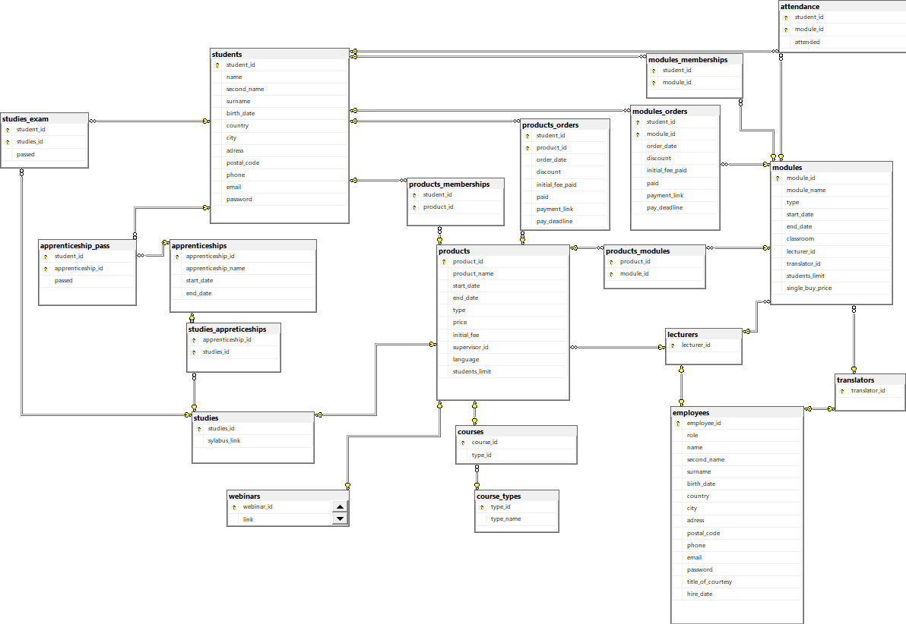

# PROJEKT PBD

## Zespół 8

Tomasz Żmuda, Konrad Konsek, Jakub Cieszewski

## 1. FUNKCJE REALIZOWANE PRZEZ SYSTEM

1. Użytkownik bez konta Użytkownik bez konta

- Zarejestrowanie konta

2. Użytkownik z kontem

- Zarządzanie koszykiem (dodaj produkt, usuń produkt, zapłać)

- Zapis na kurs/webinar/studia/praktyki

- Zalogowanie do systemu

- Podgląd dostępnych kursów/webinarów/studiów/praktyk

- Dostęp do historii swoich kursów

- Dostęp do harmonogramu

3. Wykładowca

- Zarządzanie listą uczestników w poszczególnych kursach

- Dostęp do informacji o kursach

- Dostęp do harmonogramu (dodawanie, usuwanie, edycja)

- Możliwość generowania raportów o nadchodzących wydarzeniach i raportów obecności na poszczególnych szkoleniach

4. Dyrektor

- Zarządzanie opłatami użytkowników (dodaj rabat, pokaż długi użytkowników, wyświetl raporty finansowe)

- Zarządzanie pracownikami (dodaj, usuń, edytuj, przypisz do kursu)

- Zarządzanie kursami (dodaj, usuń, edytuj)

- Zarządzanie praktykami (dodaj, usuń, edytuj, przypisz do studiów)

5. Pani z dziekanatu

- Dostęp do harmonogramu (dodawanie, usuwanie, edycja)

- Zarządzanie opłatami użytkowników (dodaj rabat, pokaż długi użytkowników, wyświetl raporty finansowe)

- Zarządzanie kursami (dodaj, usuń, edytuj)

- Zarządzanie praktykami (dodaj, usuń, edytuj, przypisz do studiów)

<div style="page-break-after: always;"></div>

## 2. Diagram bazy danych



<div style="page-break-after: always;"></div>

## 3. Opis tabel

1. Tabela “students”

Ogólne informacje o studentach: imię, nazwisko, adres, numer telefonu, adres mailowy oraz hasło do konta.

- student_id - numer id studenta (PK)
- name - imię studenta
- second name - drugie imię studenta
- surname - nazwisko studenta
- birth_date - data urodzenia studenta
- country - kraj zamieszkania studenta
- city - miasto zamieszkania studenta
- adress - adres zamieszkania studenta: ulica i numer mieszkania
- postal_code - kod pocztowy studenta
- phone - numer telefonu studenta
- email - adres email studenta
- password - hasło studenta

<div style="page-break-after: always;"></div>

```sql
CREATE TABLE [dbo].[students](
	[student_id] [int] IDENTITY(1,1) NOT NULL,
	[name] [varchar](50) NOT NULL,
	[second_name] [varchar](50) NULL,
	[surname] [varchar](50) NOT NULL,
	[birth_date] [date] NOT NULL,
	[country] [varchar](50) NOT NULL,
	[city] [varchar](50) NOT NULL,
	[adress] [varchar](50) NOT NULL,
	[postal_code] [varchar](50) NULL,
	[phone] [varchar](50) NOT NULL,
	[email] [varchar](50) NOT NULL,
	[password] [varchar](60) NOT NULL,
 CONSTRAINT [PK_students] PRIMARY KEY CLUSTERED 
(
	[student_id] ASC
)
) ON [PRIMARY]
GO

ALTER TABLE [dbo].[students]  WITH CHECK ADD  CONSTRAINT 
	[validBirthdate0] CHECK  ((datepart(year,[birth_date])>(1900) AND 
	datepart(year,[birth_date])<datepart(year,sysdatetime())))
GO

ALTER TABLE [dbo].[students] CHECK CONSTRAINT [validBirthdate0]
GO

ALTER TABLE [dbo].[students]  WITH CHECK ADD CONSTRAINT 
	[validEmail] CHECK  (([email] like '%@%'))
GO

ALTER TABLE [dbo].[students] CHECK CONSTRAINT [validEmail]
GO
```

<div style="page-break-after: always;"></div>

2. Tabela “employees”

Ogólne informacje o pracownikach: imię, nazwisko, tytuł, rola w firmie, numer telefonu, adres mailowy oraz hasło do konta.

- employee_id - numer id pracownika (PK)
- role - rola w firmie pracownika
- name - imię pracownika
- second_name - drugie imię pracownika
- surname - nazwisko pracownika
- birth_date - data urodzenia pracownika
- country - kraj zamieszkania pracownika
- city - miasto zamieszkania pracownika
- adress - adres pracownika: ulica i numer miezkania
- postal_code - kod pocztowy pracownika
- phone - numer telefonu pracownika
- email - adres email pracownika
- password - hasło pracownika
- title_of_courtesy - tytuł pracownika
- hire_date - data zatrudnienia pracownika

<div style="page-break-after: always;"></div>

```sql
CREATE TABLE [dbo].[employees](
	[employee_id] [int] IDENTITY(1,1) NOT NULL,
	[role] [varchar](50) NOT NULL,
	[name] [varchar](50) NOT NULL,
	[second_name] [varchar](50) NULL,
	[surname] [varchar](50) NOT NULL,
	[birth_date] [date] NOT NULL,
	[country] [varchar](50) NOT NULL,
	[city] [varchar](50) NOT NULL,
	[adress] [varchar](50) NOT NULL,
	[postal_code] [varchar](50) NULL,
	[phone] [varchar](50) NOT NULL,
	[email] [varchar](50) NOT NULL,
	[password] [varchar](60) NOT NULL,
	[title_of_courtesy] [varchar](10) NOT NULL,
	[hire_date] [date] NOT NULL,
 CONSTRAINT [PK_employees] PRIMARY KEY CLUSTERED 
(
	[employee_id] ASC
)
) ON [PRIMARY]
GO

ALTER TABLE [dbo].[employees]  WITH CHECK ADD  CONSTRAINT
	[employeesValidBirthDate] CHECK  ((datepart(year,[birth_date])>(1899) AND 
	datepart(year,[birth_date])<datepart(year,getdate())))
GO

ALTER TABLE [dbo].[employees] CHECK CONSTRAINT [employeesValidBirthDate]
GO

ALTER TABLE [dbo].[employees]  WITH CHECK ADD  CONSTRAINT [employeesValidEmail] CHECK  (([email] like '%@%'))
GO

ALTER TABLE [dbo].[employees] CHECK CONSTRAINT [employeesValidEmail]
GO
```

<div style="page-break-after: always;"></div>

3. Tabela “products”

Informacje o dostępnych produktach (webinary, kursy, studia). 
Typ produktu, nazwa produktu, data rozpoczęcia i zakończenia, cena, zaliczka, opiekun, język prowadzenia, limit miejsc.

- product_id - numer id produktu (PK)
- product_name - nazwa produktu
- start_date - data rozpoczęcia dla produktu
- end_date - data zakończenia dla produktu
- type - typ produktu: webinar, kurs lub studia
- price - cena produktu
- initial_fee - zaliczka
- supervisor_id - numer id opiekuna produktu (FK)
- language - język w którym produkt jest prowadzony
- students_limit - limit studentów na kursie, o ile istnieje

<div style="page-break-after: always;"></div>

```sql
CREATE TABLE [dbo].[products](
	[product_id] [int] IDENTITY(1,1) NOT NULL,
	[product_name] [varchar](50) NOT NULL,
	[start_date] [datetime] NOT NULL,
	[end_date] [datetime] NOT NULL,
	[type] [varchar](50) NOT NULL,
	[price] [numeric](10,2) NOT NULL,
	[initial_fee] [numeric](10,2) NOT NULL,
	[supervisor_id] [int] NOT NULL,
	[language] [varchar](50) NOT NULL,
	[students_limit] [int] NULL,
 CONSTRAINT [PK_products] PRIMARY KEY CLUSTERED 
(
	[product_id] ASC
)
) ON [PRIMARY]
GO

ALTER TABLE [dbo].[products]  WITH CHECK ADD  CONSTRAINT 
	[FK_products_lecturers] FOREIGN KEY([supervisor_id])
REFERENCES [dbo].[lecturers] ([lecturer_id])
GO

ALTER TABLE [dbo].[products] CHECK CONSTRAINT [FK_products_lecturers]
GO

ALTER TABLE [dbo].[products]  WITH CHECK ADD  CONSTRAINT 
	[productsValidDuration] CHECK  (([start_date]<=[end_date]))
GO

ALTER TABLE [dbo].[products] CHECK CONSTRAINT [productsValidDuration]
GO

ALTER TABLE [dbo].[products]  WITH CHECK ADD  CONSTRAINT 
	[validInitialFee] CHECK  (([initial_fee]>=(0)))
GO

ALTER TABLE [dbo].[products] CHECK CONSTRAINT [validInitialFee]
GO

ALTER TABLE [dbo].[products]  WITH CHECK ADD  CONSTRAINT 
	[validPrice] CHECK  (([price]>=(0)))
GO

ALTER TABLE [dbo].[products] CHECK CONSTRAINT [validPrice]
GO
```

<div style="page-break-after: always;"></div>

4. Tabela “modules”

Informację o modułach: nazwa, typ(kurs, webinar, studium), sala lekcyjna, id prowadzącego moduł, id ewentualnego tłumacza, limit miejsc, cena dla osób spoza kursu, data rozpoczęcia i zakończenia.
Jako moduł traktowana jest każda jednostka taka jak wykład, ćwiczenia, dzień kursu, webinar.

- module_id - numer id modułu (PK)
- module_name - nazwa modułu
- type - typ prowadzenia modułu: online, stacjonarnie etc.
- start_date - data rozpoczęcia modułu
- end_date - data zakończenia modułu
- classroom - numer klasy lub link do spotkania online
- lecturer_id - numer id prowadzącego (FK)
- translator_id - numer id tłumacza, o ile taki jest (FK)
- students_limit - limit studentów na module, o ile istnieje
- single_buy_price - cena zakupu pojedynczego modułu

<div style="page-break-after: always;"></div>

```sql
CREATE TABLE [dbo].[modules](
	[module_id] [int] IDENTITY(1,1) NOT NULL,
	[module_name] [varchar](50) NOT NULL,
	[type] [varchar](50) NOT NULL,
	[start_date] [datetime] NOT NULL,
	[end_date] [datetime] NOT NULL,
	[classroom] [varchar](50) NOT NULL,
	[lecturer_id] [int] NOT NULL,
	[translator_id] [int] NULL,
	[students_limit] [int] NULL,
	[single_buy_price] [numeric](10,2) NOT NULL,
 CONSTRAINT [PK_modules_1] PRIMARY KEY CLUSTERED 
(
	[module_id] ASC
)
) ON [PRIMARY]
GO

ALTER TABLE [dbo].[modules]  WITH CHECK ADD  CONSTRAINT 
	[FK_modules_lecturers] FOREIGN KEY([lecturer_id])
REFERENCES [dbo].[lecturers] ([lecturer_id])
GO

ALTER TABLE [dbo].[modules] CHECK CONSTRAINT [FK_modules_lecturers]
GO

ALTER TABLE [dbo].[modules]  WITH CHECK ADD  CONSTRAINT 
	[FK_modules_translators] FOREIGN KEY([translator_id])
REFERENCES [dbo].[translators] ([translator_id])
GO

ALTER TABLE [dbo].[modules] CHECK CONSTRAINT [FK_modules_translators]
GO

ALTER TABLE [dbo].[modules]  WITH CHECK ADD  CONSTRAINT 
	[modulesValidDuration] CHECK  (([start_date]<=[end_date]))
GO

ALTER TABLE [dbo].[modules] CHECK CONSTRAINT [modulesValidDuration]
GO

ALTER TABLE [dbo].[modules]  WITH CHECK ADD  CONSTRAINT 
	[validSingleBuyPrice] CHECK  (([single_buy_price]>=(0)))
GO

ALTER TABLE [dbo].[modules] CHECK CONSTRAINT [validSingleBuyPrice]
GO
```

<div style="page-break-after: always;"></div>

5. Tabela “products_modules”

Tabela służąca do przyporządkowania modułów do studiów.

- module_id - numer id modułu (PK)
- product_id - numer id produktu (PK)

```sql
CREATE TABLE [dbo].[products_modules](
	[product_id] [int] NOT NULL,
	[module_id] [int] NOT NULL,
 CONSTRAINT [PK_products_modules_1] PRIMARY KEY CLUSTERED
(
	[product_id] ASC,
	[module_id] ASC
)
) ON [PRIMARY]
GO

ALTER TABLE [dbo].[products_modules]  WITH CHECK ADD CONSTRAINT 
	[FK_products_modules_modules] FOREIGN KEY([module_id])
REFERENCES [dbo].[modules] ([module_id])
GO

ALTER TABLE [dbo].[products_modules] CHECK CONSTRAINT [FK_products_modules_modules]
GO

ALTER TABLE [dbo].[products_modules]  WITH CHECK ADD CONSTRAINT 
	[FK_products_modules_products] FOREIGN KEY([product_id])
REFERENCES [dbo].[products] ([product_id])
GO

ALTER TABLE [dbo].[products_modules] CHECK CONSTRAINT [FK_products_modules_products]
GO
```

<div style="page-break-after: always;"></div>

6. Tabela “courses”

Informacja o typie kursu – stacjonarny/online synchroniczny/online asynchroniczny/hybrydowy.

- course_id - numer kursu (PK)
- type - typ prowadzenia kursu

```sql
CREATE TABLE [dbo].[courses](
	[course_id] [int] NOT NULL,
	[type_id] [int] NOT NULL,
 CONSTRAINT [PK_courses] PRIMARY KEY CLUSTERED
(
	[course_id] ASC
)
) ON [PRIMARY]
GO

ALTER TABLE [dbo].[courses]  WITH CHECK ADD CONSTRAINT 
	[FK_courses_course_types] FOREIGN KEY([type_id])
REFERENCES [dbo].[course_types] ([type_id])
GO

ALTER TABLE [dbo].[courses] CHECK CONSTRAINT [FK_courses_course_types]
GO

ALTER TABLE [dbo].[courses]  WITH CHECK ADD CONSTRAINT 
	[FK_courses_products] FOREIGN KEY([course_id])
REFERENCES [dbo].[products] ([product_id])
GO

ALTER TABLE [dbo].[courses] CHECK CONSTRAINT [FK_courses_products]
GO
```

<div style="page-break-after: always;"></div>

7. Tabela “webinars”

Zawiera linki do webinarów.

- webinar_id - numer id webinaru (PK)
- link - link do pokoju online w którym odbędzie się webinar

```sql
CREATE TABLE [dbo].[webinars](
	[webinar_id] [int] NOT NULL,
	[link] [varchar](100) NOT NULL,
 CONSTRAINT [PK_webinars] PRIMARY KEY CLUSTERED
(
	[webinar_id] ASC
)
) ON [PRIMARY]
GO

ALTER TABLE [dbo].[webinars]  WITH CHECK ADD CONSTRAINT 
	[FK_webinars_products] FOREIGN KEY([webinar_id])
REFERENCES [dbo].[products] ([product_id])
GO

ALTER TABLE [dbo].[webinars] CHECK CONSTRAINT [FK_webinars_products]
GO
```

<div style="page-break-after: always;"></div>

8. Tabela “studies”

Zawiera linki do sylabusa studiów.

- studies_id - numer id studiów (PK)
- syllabus_link - link do syllabus’u studiów

```sql
CREATE TABLE [dbo].[studies](
	[studies_id] [int] NOT NULL,
	[sylabus_link] [varchar](100) NOT NULL,
 CONSTRAINT [PK_studies] PRIMARY KEY CLUSTERED
(
	[studies_id] ASC
)
) ON [PRIMARY]
GO

ALTER TABLE [dbo].[studies]  WITH CHECK ADD CONSTRAINT 
	[FK_studies_products] FOREIGN KEY([studies_id])
REFERENCES [dbo].[products] ([product_id])
GO

ALTER TABLE [dbo].[studies] CHECK CONSTRAINT [FK_studies_products]
GO
```

<div style="page-break-after: always;"></div>

9. Tabela “apprenticeships”

Informację o praktykach: nazwa, data rozpoczęcia i zakończenia

- apprenticeship_id - numer id praktyk (PK)
- apprenticeship_name - nazwa praktyk
- start_date - data rozpoczęcia praktyk
- end_date - data zakończenia praktyk

```sql
CREATE TABLE [dbo].[apprenticeships](
	[apprenticeship_id] [int] IDENTITY(1,1) NOT NULL,
	[apprenticeship_name] [varchar](50) NULL,
	[start_date] [datetime] NULL,
	[end_date] [datetime] NULL,
 CONSTRAINT [PK_apprenticeships] PRIMARY KEY CLUSTERED 
(
	[apprenticeship_id] ASC
)
) ON [PRIMARY]
GO

ALTER TABLE [dbo].[apprenticeships]  WITH CHECK ADD  CONSTRAINT 
	[apprenticeshipsValidDuration] CHECK  (([start_date]<=[end_date]))
GO

ALTER TABLE [dbo].[apprenticeships] CHECK CONSTRAINT [apprenticeshipsValidDuration]
GO
```

<div style="page-break-after: always;"></div>

10. Tabela “studies_apprenticeships”

Tabela służąca do przyporządkowania praktyk do studiów

- apprenticeship_id - numer id praktyk (PK)
- studies_id - numer id studiów (PK)

```sql
CREATE TABLE [dbo].[studies_appreticeships](
	[apprenticeship_id] [int] NOT NULL,
	[studies_id] [int] NOT NULL,
 CONSTRAINT [PK_studies_appreticeships_1] PRIMARY KEY CLUSTERED
(
	[apprenticeship_id] ASC,
	[studies_id] ASC
)
) ON [PRIMARY]
GO

ALTER TABLE [dbo].[studies_appreticeships]  WITH CHECK ADD CONSTRAINT 
	[FK_studies_appreticeships_apprenticeships] FOREIGN KEY([apprenticeship_id])
REFERENCES [dbo].[apprenticeships] ([apprenticeship_id])
GO

ALTER TABLE [dbo].[studies_appreticeships] CHECK CONSTRAINT [FK_studies_appreticeships_apprenticeships]
GO

ALTER TABLE [dbo].[studies_appreticeships]  WITH CHECK ADD CONSTRAINT 
	[FK_studies_appreticeships_studies] FOREIGN KEY([studies_id])
REFERENCES [dbo].[studies] ([studies_id])
GO

ALTER TABLE [dbo].[studies_appreticeships] CHECK CONSTRAINT [FK_studies_appreticeships_studies]
GO
```

<div style="page-break-after: always;"></div>

11. Tabela “modules_memberships”

Tabela służąca do przechowywania modułów posiadanych przez studentów

- student_id - numer id studenta do którego należy moduł (PK)
- module_id - numer id modułu (PK)

```sql
CREATE TABLE [dbo].[modules_memberships](
	[student_id] [int] NOT NULL,
	[module_id] [int] NOT NULL,
 CONSTRAINT [PK_shopping_cart_1] PRIMARY KEY CLUSTERED 
(
	[student_id] ASC,
	[module_id] ASC
)
) ON [PRIMARY]
GO

ALTER TABLE [dbo].[modules_memberships]  WITH CHECK ADD  CONSTRAINT 
	[FK_modules_memberships_modules] FOREIGN KEY([module_id])
REFERENCES [dbo].[modules] ([module_id])
GO

ALTER TABLE [dbo].[modules_memberships] CHECK CONSTRAINT [FK_modules_memberships_modules]
GO

ALTER TABLE [dbo].[modules_memberships]  WITH CHECK ADD  CONSTRAINT 
	[FK_shopping_cart_students] FOREIGN KEY([student_id])
REFERENCES [dbo].[students] ([student_id])
GO

ALTER TABLE [dbo].[modules_memberships] CHECK CONSTRAINT [FK_shopping_cart_students]
GO
```

<div style="page-break-after: always;"></div>

12. Tabela “attendance”

Tabela przechowująca informację o obecności studentów na modułach.

- student_id - numer id studenta (PK)
- module_id - numer id modułu (PK)
- attended - informacja o tym czy student był obecny na module

```sql
CREATE TABLE [dbo].[attendance](
	[student_id] [int] NOT NULL,
	[module_id] [int] NOT NULL,
	[attended] [bit] NOT NULL,
 CONSTRAINT [PK_attendance_1] PRIMARY KEY CLUSTERED
(
	[student_id] ASC,
	[module_id] ASC
)
) ON [PRIMARY]
GO

ALTER TABLE [dbo].[attendance]  WITH CHECK ADD CONSTRAINT 
	[FK_attendance_modules] FOREIGN KEY([module_id])
REFERENCES [dbo].[modules] ([module_id])
GO

ALTER TABLE [dbo].[attendance] CHECK CONSTRAINT [FK_attendance_modules]
GO

ALTER TABLE [dbo].[attendance]  WITH CHECK ADD CONSTRAINT 
	[FK_attendance_students] FOREIGN KEY([student_id])
REFERENCES [dbo].[students] ([student_id])
GO

ALTER TABLE [dbo].[attendance] CHECK CONSTRAINT [FK_attendance_students]
GO

```

<div style="page-break-after: always;"></div>

13. Tabela “products_memberships”

Tabela służąca do przechowywania produktów posiadanych przez studentów

- student_id - numer id studenta do którego należy moduł (PK)
- product_id - numer id produktu (PK)

```sql
CREATE TABLE [dbo].[products_memberships](
	[student_id] [int] NOT NULL,
	[product_id] [int] NOT NULL,
 CONSTRAINT [PK_memberships_1] PRIMARY KEY CLUSTERED 
(
	[student_id] ASC,
	[product_id] ASC
)
) ON [PRIMARY]
GO

ALTER TABLE [dbo].[products_memberships]  WITH CHECK ADD  CONSTRAINT 
	[FK_memberships_students] FOREIGN KEY([student_id])
REFERENCES [dbo].[students] ([student_id])
GO

ALTER TABLE [dbo].[products_memberships] CHECK CONSTRAINT [FK_memberships_students]
GO

ALTER TABLE [dbo].[products_memberships]  WITH CHECK ADD  CONSTRAINT 
	[FK_products_memberships_products] FOREIGN KEY([product_id])
REFERENCES [dbo].[products] ([product_id])
GO

ALTER TABLE [dbo].[products_memberships] CHECK CONSTRAINT [FK_products_memberships_products]
GO
```

<div style="page-break-after: always;"></div>

14. Tabela "translators"

Tabela przechowująca identyfikatory tłumaczów

- translator_id - numer id tłumacza (PK)

```sql
CREATE TABLE [dbo].[translators](
	[translator_id] [int] NOT NULL,
 CONSTRAINT [PK_translators] PRIMARY KEY CLUSTERED
(
	[translator_id] ASC
)
) ON [PRIMARY]
GO

ALTER TABLE [dbo].[translators]  WITH CHECK ADD CONSTRAINT 
	[FK_translators_employees] FOREIGN KEY([translator_id])
REFERENCES [dbo].[employees] ([employee_id])
GO

ALTER TABLE [dbo].[translators] CHECK CONSTRAINT [FK_translators_employees]
GO

```

<div style="page-break-after: always;"></div>

15. Tabela "lecturers"

Tabela przechowująca identyfikatory wykładowców

- lecturer_id - numer id wykładowcy (PK)

```sql
CREATE TABLE [dbo].[lecturers](
	[lecturer_id] [int] NOT NULL,
 CONSTRAINT [PK_lecturers] PRIMARY KEY CLUSTERED
(
	[lecturer_id] ASC
)
) ON [PRIMARY]
GO

ALTER TABLE [dbo].[lecturers]  WITH CHECK ADD CONSTRAINT 
	[FK_lecturers_employees] FOREIGN KEY([lecturer_id])
REFERENCES [dbo].[employees] ([employee_id])
GO

ALTER TABLE [dbo].[lecturers] CHECK CONSTRAINT [FK_lecturers_employees]
GO
```

<div style="page-break-after: always;"></div>

16. Tabela modules_orders

Tabela przechowująca informacje o płatnościach za moduły, przechowująca także moduły w koszyku jeszcze nieopłacone

- student_id - numer id studenta (PK)
- module_id - numer id modułu (PK)
- order_date - data dodania modułu do koszyka
- discount - przyznana przecena
- initial_fee_paid - informacja o tym czy zaliczka została wpłacona
- paid - informacja o tym czy cała opłata za moduł została wpłacona
- payment_link - link do płatności
- pay_deadline - data do której trzeba wpłacić całą opłatę

```sql
CREATE TABLE [dbo].[modules_orders](
	[student_id] [int] NOT NULL,
	[module_id] [int] NOT NULL,
	[order_date] [datetime] NOT NULL,
	[discount] [float] NOT NULL,
	[initial_fee_paid] [bit] NOT NULL,
	[paid] [bit] NOT NULL,
	[payment_link] [varchar](255) NOT NULL,
	[pay_deadline] [datetime] NOT NULL,
 CONSTRAINT [PK_modules_orders] PRIMARY KEY CLUSTERED 
(
	[student_id] ASC,
	[module_id] ASC
)
) ON [PRIMARY]
GO

ALTER TABLE [dbo].[modules_orders]  WITH CHECK ADD  CONSTRAINT 
	[FK_modules_orders_modules] FOREIGN KEY([module_id])
REFERENCES [dbo].[modules] ([module_id])
GO

ALTER TABLE [dbo].[modules_orders] CHECK CONSTRAINT [FK_modules_orders_modules]
GO

ALTER TABLE [dbo].[modules_orders]  WITH CHECK ADD  CONSTRAINT 
	[FK_modules_orders_students] FOREIGN KEY([student_id])
REFERENCES [dbo].[students] ([student_id])
GO

ALTER TABLE [dbo].[modules_orders] CHECK CONSTRAINT [FK_modules_orders_students]
GO
```
<div style="page-break-after: always;"></div>

17. Tabela products_orders

Tabela przechowująca informacje o płatnościach za produkty, przechowująca także moduły w koszyku jeszcze nieopłacone

- student_id - numer id studenta (PK)
- produkt_id - numer id produktu (PK)
- order_date - data dodania produktu do koszyka
- discount - przyznana przecena
- initial_fee_paid - informacja o tym czy zaliczka została wpłacona
- paid - informacja o tym czy cała opłata za moduł została wpłacona
- payment_link - link do płatności
- pay_deadline - data do której trzeba wpłacić całą opłatę

```sql
CREATE TABLE [dbo].[products_orders](
	[student_id] [int] NOT NULL,
	[product_id] [int] NOT NULL,
	[order_date] [datetime] NOT NULL,
	[discount] [float] NOT NULL,
	[initial_fee_paid] [bit] NOT NULL,
	[paid] [bit] NOT NULL,
	[payment_link] [varchar](255) NOT NULL,
	[pay_deadline] [datetime] NOT NULL,
 CONSTRAINT [PK_products_orders] PRIMARY KEY CLUSTERED 
(
	[student_id] ASC,
	[product_id] ASC
)
) ON [PRIMARY]
GO

ALTER TABLE [dbo].[products_orders]  WITH CHECK ADD  CONSTRAINT 
	[FK_products_orders_products] FOREIGN KEY([product_id])
REFERENCES [dbo].[products] ([product_id])
GO

ALTER TABLE [dbo].[products_orders] CHECK CONSTRAINT [FK_products_orders_products]
GO

ALTER TABLE [dbo].[products_orders]  WITH CHECK ADD  CONSTRAINT 
	[FK_products_orders_students] FOREIGN KEY([student_id])
REFERENCES [dbo].[students] ([student_id])
GO

ALTER TABLE [dbo].[products_orders] CHECK CONSTRAINT [FK_products_orders_students]
GO
```

<div style="page-break-after: always;"></div>

# Widoki

1. Widok showNotStartedModules

Wyświetla moduły które jeszcze się nie zaczęły

```sql
CREATE VIEW [dbo].[showNotStartedModules]
AS
    SELECT module_id, module_name, type, start_date,
        end_date, classroom, lecturer_id, translator_id,
        students_limit, single_buy_price
    FROM dbo.modules
    WHERE  (start_date > GETDATE())
GO
```

<div style="page-break-after: always;"></div>

2. Widok showNotStartedProducts

Wyświetla produkty które jescze się nie zaczęły

```sql
CREATE VIEW [dbo].[showNotStartedProducts]
AS
    SELECT product_id, product_name, start_date, end_date,
        type, price, initial_fee, supervisor_id, language,
        students_limit
    FROM dbo.products
	WHERE  (start_date > GETDATE())
GO
```

<div style="page-break-after: always;"></div>

3. Widok showDebt

Wyświetla wszytkich studentów, którzy zalegają z opłatami za moduły i produkty

```sql
CREATE VIEW [dbo].[showDebt] AS
SELECT s.student_id, s.name, s.surname, m.module_name AS [moduły/produkty]
FROM dbo.modules_orders AS mo 
INNER JOIN dbo.students AS s 
	ON mo.student_id = s.student_id AND paid = 0
JOIN dbo.modules AS m 
	ON m.module_id = mo.module_id
GROUP BY s.student_id, s.name, s.surname, m.module_name

UNION

SELECT s.student_id, s.name, s.surname, p.product_name
FROM dbo.products_orders AS po INNER JOIN
dbo.students AS s ON po.student_id = s.student_id AND paid = 0
JOIN dbo.products AS p ON p.product_id = po.product_id
GROUP BY s.student_id, s.name, s.surname, p.product_name;
GO
```

<div style="page-break-after: always;"></div>

4. Widok attendanceOnFinishedProducts

Wyświetla średnią obecność dla zakończonych produktów

```sql
CREATE VIEW [dbo].[attendanceOnFinishedProducts]
AS
SELECT        product_name, start_date, end_date, dbo.getAverageAttendanceOnProduct(product_id) AS attendance
FROM            dbo.products
WHERE        (end_date < GETDATE())
GO
```

<div style="page-break-after: always;"></div>

5. Widok checkModulesFullness

Wyświetla dla każdego modułu limit studentów, ilość zapisanych studentów i czy moduł jest pełny

```sql
create view [dbo].[checkModulesFullness] as
with t1 as (
SELECT 
    m.module_name, 
    m.students_limit, 
    COUNT(*) AS [amount of students],
    CASE 
        WHEN (students_limit is Null  OR COUNT(*) < m.students_limit) THEN 'not full'
        ELSE 'full'
    END AS status
FROM modules_memberships AS mm
JOIN modules AS m ON m.module_id = mm.module_id
GROUP BY m.module_name, m.students_limit)

SELECT 
    m.module_name, 
    m.students_limit, 
    0 AS [amount of students],
	'not full' AS status
FROM modules AS m
LEFT JOIN t1 ON m.module_name = t1.module_name
WHERE t1.module_name IS NULL

UNION ALL

SELECT 
    module_name, 
    students_limit, 
    [amount of students],
	status
FROM t1
GO
```

<div style="page-break-after: always;"></div>

6. Widok checkProductFullness

Wyświetla dla każdego produktu limit studentów, ilość zapisanych studentów i czy produkt jest pełny

```sql
create view [dbo].[checkProductFullness] as
with t1 as (
SELECT 
    p.product_name, 
    p.students_limit, 
    COUNT(*) AS [amount of students],
    CASE 
        WHEN (students_limit is Null  OR COUNT(*) < p.students_limit) THEN 'not full'
        ELSE 'full'
    END AS status
FROM products_memberships AS pm
JOIN products AS p ON p.product_id = pm.product_id
GROUP BY p.product_name, p.students_limit)

SELECT 
    p.product_name, 
    p.students_limit, 
    0 AS [amount of students],
	'not full' AS status
FROM products AS p
LEFT JOIN t1 ON p.product_name = t1.product_name
WHERE t1.product_name IS NULL

UNION ALL

SELECT 
    product_name, 
    students_limit, 
    [amount of students],
	status
FROM t1
GO
```

<div style="page-break-after: always;"></div>

7. Widok getOverlappingModulesForStudents

Sprawdza dla każdego studenta czy jest zapisany na moduły które odbywają się w tym samym czasie.
Jeżeli tak to wyświetla imię i nazwisko studenta, nazwy modułów które się pokrywają, i daty rozpoczęcia
i zakończenia każdego modułu.

```sql
CREATE VIEW [dbo].[getOverlappingModulesForStudents] AS
SELECT DISTINCT
    s.name,
    s.surname,
    m1.module_name AS course_name_1,
    m1.start_date AS start_date_1,
    m1.end_date AS end_date_1,
    m2.module_name AS course_name_2,
    m2.start_date AS start_date_2,
    m2.end_date AS end_date_2
FROM
    students AS s
JOIN
    modules_memberships AS mm1 ON s.student_id = mm1.student_id
JOIN
    modules AS m1 ON m1.module_id = mm1.module_id
JOIN
    modules_memberships AS mm2 ON s.student_id = mm2.student_id
JOIN
    modules AS m2 ON m2.module_id = mm2.module_id
WHERE
    m1.module_id < m2.module_id
    AND (m1.start_date BETWEEN m2.start_date AND m2.end_date OR m1.end_date BETWEEN m2.start_date AND m2.end_date);

GO
```

<div style="page-break-after: always;"></div>

8. Widok showAllCourses

Wyświetla nazwy wszystki kursów

```sql
create view [dbo].[showAllCourses] as
select product_name
from products
where type = 'course'
GO
```

<div style="page-break-after: always;"></div>

9. Widok showAllWebinars

Wyświetla wszystkie webinary

```sql
CREATE VIEW [dbo].[showAllWebinars] AS
SELECT product_name
FROM products
WHERE TYPE = 'webinar';
GO
```

<div style="page-break-after: always;"></div>

10. Widok showAllModules

Wyświetla wszystkie moduły

```sql
CREATE VIEW [dbo].[showAllModules]
AS
SELECT 
	module_id, 
	module_name, 
	type, 
	start_date, 
	end_date, 
	classroom, lecturer_id, 
	translator_id, students_limit, 
	single_buy_price
FROM dbo.modules
GO
```

<div style="page-break-after: always;"></div>

11. Widok showEnrolledInFutureEvents

Wyświetla ilość osób zapisanych poszczególne moduły i produkty, które jeszcze się nie zaczęły

```sql
CREATE VIEW [dbo].[showEnrolledInFutureEvents] AS 
SELECT product_name AS event, COUNT(*) AS enrolled, 'product' AS type
FROM products AS p
JOIN products_memberships AS pm ON pm.product_id = p.product_id
WHERE p.start_date > GETDATE()
GROUP BY product_name

UNION ALL

SELECT module_name AS event, COUNT(*) AS enrolled, 'module' AS type
FROM modules AS m
JOIN modules_memberships AS mm ON mm.module_id = m.module_id
WHERE m.start_date > GETDATE()
GROUP BY module_name;
GO
```

<div style="page-break-after: always;"></div>

12. Widok showModuleRevenue

Wyświetla przychód wygenerowany przez dany moduł

```sql
CREATE VIEW [dbo].[showModuleRevenue]
AS
SELECT 
	modules.module_id, 
	modules.module_name, 
	modules.type, 
	modules.single_buy_price, 
	SUM((modules.single_buy_price * modules_orders.paid) * 
	(1 - modules_orders.discount)) AS revenue
FROM modules_orders 
	INNER JOIN modules 
	ON modules_orders.module_id = modules.module_id
GROUP BY modules.module_id, 
	modules.module_name, 
	modules.type, 
	modules.single_buy_price;
GO
```
<div style="page-break-after: always;"></div>

13. Widok showProductRevenue

Wyświetla przychód wygenerowany przez dany produkt

```sql
CREATE VIEW [dbo].[showProductRevenue]
AS
SELECT products.product_id, 
	products.product_name, 
	products.type, products.price, 
	products.initial_fee, 
	ISNULL(SUM((products.price * products_orders.paid + 
		products.initial_fee * products_orders.initial_fee_paid) *
		(1 - products_orders.discount)), 0) AS revenue
FROM products_orders 
	RIGHT OUTER JOIN products 
	ON products_orders.product_id = products.product_id
GROUP BY products.product_id, 
	products.product_name, 
	products.type, 
	products.price, 
	products.initial_fee
GO
```
<div style="page-break-after: always;"></div>

14. Widok showNotFullProducts

Wyświetla wszystkie produkty na które limit miejsc nie został przekroczony

```sql
CREATE VIEW [dbo].[showNotFullProducts]
AS
SELECT products.product_id, 
	products.product_name, 
	products.start_date, 
	products.end_date, 
	products.type, 
	products.price, 
	products.initial_fee, p
	roducts.supervisor_id, 
	products.language, 
	products.students_limit, 
	products.students_limit - COUNT(products_memberships.student_id) 
	AS remaining_spots
FROM products 
	LEFT OUTER JOIN products_memberships 
	ON products.product_id = products_memberships.product_id
GROUP BY products.product_id, 
	products.product_name, 
	products.start_date, 
	products.end_date, 
	products.type, 
	products.price, 
	products.initial_fee, 
	products.supervisor_id, 
	products.language, 
	products.students_limit
HAVING (products.students_limit - COUNT(products_memberships.student_id) IS NULL) 
	OR (products.students_limit - COUNT(products_memberships.student_id) > 0)
GO
```

<div style="page-break-after: always;"></div>

# Procedures

1. Procedura changeStudentContactInfo
   
Zmienia wszystkie dane kontaktowe studenta

```sql
CREATE PROCEDURE [dbo].[changeStudentContactInfo]
	@id int,
	@country varchar(50),
	@city varchar(50),
	@adress varchar(50),
	@postal_code varchar(50),
	@phone varchar(50),
	@email varchar(50)
AS
BEGIN
	SET NOCOUNT ON;
	BEGIN TRY
		BEGIN
			UPDATE students
				SET country = @country, city = @city,
                                    adress = @adress, postal_code = @postal_code,
                                    phone = @phone, email = @email
				where student_id = @id
		END
	END TRY
	BEGIN CATCH
		DECLARE @msg nvarchar(2048)
			=N'Błąd aktualizowania danych: ' + ERROR_MESSAGE();
		THROW 52000, @msg, 1
	END CATCH
END
GO
```

<div style="page-break-after: always;"></div>

2. Procedura changeAttendance
   
Zmienia status obecności studenta na danym module na obecny

```sql
CREATE PROCEDURE [dbo].[changeAttendance]
	@student_id INT,
	@module_id INT,
	@attended BIT
AS
BEGIN
	SET NOCOUNT ON;
	BEGIN TRY
		IF NOT EXISTS(
			SELECT * 
			FROM attendance
			WHERE student_id = @student_id AND module_id = @module_id 
		)
		BEGIN;
			THROW 52000, N'Podany rekord nie istnieje', 1;
		END;
		BEGIN
			UPDATE attendance
			SET attended = @attended
			WHERE student_id = @student_id AND module_id = @module_id;
		END;
	END TRY
	BEGIN CATCH
		DECLARE @msg NVARCHAR(2048)
			=N'Błąd z wpisywaniem obecności: ' + ERROR_MESSAGE();
		THROW 52000, @msg, 1;
	END CATCH;
END;
GO
```

<div style="page-break-after: always;"></div>

3. Procedura changeEmployeeContactInfo
   
Zmienia danek konraktowe pracowników

```sql
CREATE PROCEDURE [dbo].[changeEmployeeContactInfo]
	@id int,
	@country varchar(50),
	@city varchar(50),
	@adress varchar(50),
	@postal_code varchar(50),
	@phone varchar(50),
	@email varchar(50)
AS
BEGIN
	SET NOCOUNT ON;
	BEGIN TRY
		BEGIN
			UPDATE employees
				SET 
					country = @country, 
					city = @city,
					adress = @adress, 
					postal_code = @postal_code,
					phone = @phone, 
					email = @email
				WHERE employee_id = @id
		END
	END TRY
	BEGIN CATCH
		DECLARE @msg nvarchar(2048)
			=N'Błąd zmiany danych kontaktowych: ' + ERROR_MESSAGE();
		THROW 52000, @msg, 1
	END CATCH
END
GO
```

<div style="page-break-after: always;"></div>

4. Procedura changeExamToPassed
   
Ustawia status zaliczenia danego egzaminu na zaliczony

```sql
CREATE PROCEDURE [dbo].[changeExamToPassed]
	@student_id int,
	@studies_id int
AS
BEGIN
	SET NOCOUNT ON;
	BEGIN TRY
		BEGIN
			UPDATE studies_exam
				set passed = 1
				where student_id = @student_id and
                                    studies_id = @studies_id
		END
	END TRY
	BEGIN CATCH
		DECLARE @msg nvarchar(2048)
			=N'Błąd z zaliczaniem egzaminu: ' + ERROR_MESSAGE();
		THROW 52000, @msg, 1
	END CATCH
END
GO
```

<div style="page-break-after: always;"></div>

5. Procedura changeModulePaidStatus
   
Zmienia status płatności dla modułu i studenta

```sql
CREATE PROCEDURE [dbo].[changeModulePaidStatus]
	@student_id int,
	@module_id int,
	@initial_fee_paid_status bit,
	@normal_price_paid_status bit
AS
BEGIN
	SET NOCOUNT ON;
	BEGIN TRY
		BEGIN
			UPDATE modules_orders
				set initial_fee_paid = @initial_fee_paid_status, 
					paid = @normal_price_paid_status
				where student_id = @student_id and module_id = @module_id
		END
	END TRY
	BEGIN CATCH
		DECLARE @msg nvarchar(2048)
			=N'Błąd z wpisywaniem statusu płatności: ' + ERROR_MESSAGE();
		THROW 52000, @msg, 1
	END CATCH
END
GO
```

<div style="page-break-after: always;"></div>

6. Procedura changeProductPaidStatus
   
Zmienia status płatności dla danego produktu i studenta

```sql
CREATE PROCEDURE [dbo].[changeProductPaidStatus]
	@student_id int,
	@product_id int,
	@initial_fee_paid_status bit,
	@normal_price_paid_status bit
AS
BEGIN
	SET NOCOUNT ON;
	BEGIN TRY
		BEGIN
			UPDATE products_orders
				set initial_fee_paid = @initial_fee_paid_status, 
					paid = @normal_price_paid_status
				where student_id = @student_id and product_id = @product_id
		END
	END TRY
	BEGIN CATCH
		DECLARE @msg nvarchar(2048)
			=N'Błąd z wpisywaniem statusu płatności: ' + ERROR_MESSAGE();
		THROW 52000, @msg, 1
	END CATCH
END
GO
```

<div style="page-break-after: always;"></div>

7. Procedura createWebinar

Tworzy nowy webinar

```sql
CREATE PROCEDURE [dbo].[createWebinar]
	@product_name varchar(50),
	@start_date datetime,
	@end_date datetime,
	@price float,
	@initial_fee float,
	@supervisor_id int,
	@language varchar(50),
	@students_limit int,
	@link varchar(100)
AS
BEGIN
	SET NOCOUNT ON;
	BEGIN TRY
		IF @start_date > @end_date
			BEGIN;
			THROW 52000, N'Daty nie mają sensu', 1
			END

		IF not exists(
				select *
                from lecturers
                where lecturer_id = @supervisor_id
			)
			BEGIN;
			THROW 52000, N'Wykłądowca nie istnieje', 1
			END

		DECLARE @product_id INT
		SELECT @product_id = ISNULL(MAX(product_id), 0) + 1
		from products

		DECLARE @type varchar(50)
		SELECT @type = 'webinar'

		INSERT INTO [dbo].[products]
				([product_id]
				,[product_name]
				,[start_date]
				,[end_date]
				,[type]
				,[price]
				,[initial_fee]
				,[supervisor_id]
				,[language]
				,[students_limit])
			VALUES
				(@product_id
				,@product_name
				,@start_date
				,@end_date
				,@type
				,@price
				,@initial_fee
				,@supervisor_id
				,@language
				,@students_limit)

		INSERT INTO [dbo].[webinars]
				([webinar_id]
				,[link])
			 VALUES
				(@product_id
				,@link)
	END TRY
	BEGIN CATCH
		DECLARE @msg nvarchar(2048)
			=N'Błąd z dodawaniem nowego webinaru: ' + ERROR_MESSAGE();
		THROW 52000, @msg, 1
	END CATCH
END
GO
```

<div style="page-break-after: always;"></div>

8. Procedura createCourse

Tworzy kurs
```sql

CREATE PROCEDURE [dbo].[createCourse]
@product_name varchar(50),
@start_date datetime,
@end_date datetime,
@price float,
@initial_fee float,
@supervisor_id int,
@language varchar(50),
@students_limit int,
@type_id int
	
AS
BEGIN
	SET NOCOUNT ON;
	BEGIN TRY
		IF @start_date > @end_date
			BEGIN;
			THROW 52000, N'Daty nie mają sensu', 1
			END

		IF not exists(
				select * from lecturers where lecturer_id = @supervisor_id
			)
			BEGIN;
			THROW 52000, N'Wykłądowca nie istnieje', 1
			END

		DECLARE @product_id INT
		SELECT @product_id = ISNULL(MAX(product_id), 0) + 1
		from products

		DECLARE @type varchar(50)
		SELECT @type = 'course'

		INSERT INTO [dbo].[products]
				([product_id]
				,[product_name]
				,[start_date]
				,[end_date]
				,[type]
				,[price]
				,[initial_fee]
				,[supervisor_id]
				,[language]
				,[students_limit])
			VALUES
				(@product_id
				,@product_name
				,@start_date
				,@end_date
				,@type
				,@price
				,@initial_fee
				,@supervisor_id
				,@language
				,@students_limit)

		INSERT INTO [dbo].[courses]
				([course_id]
				,[type_id])
			 VALUES
				(@product_id
				,@type_id)
	END TRY
	BEGIN CATCH
		DECLARE @msg nvarchar(2048)
			=N'Błąd z dodawaniem nowego kursu: ' + ERROR_MESSAGE();
		THROW 52000, @msg, 1
	END CATCH
END
GO
```

<div style="page-break-after: always;"></div>

9. Procedura createStudies

Tworzy studia
```sql
CREATE PROCEDURE [dbo].[createStudies]
	@product_name varchar(50),
	@start_date datetime,
	@end_date datetime,
	@price float,
	@initial_fee float,
	@supervisor_id int,
	@language varchar(50),
	@students_limit int,
	@syllabus_link varchar(100)
AS
BEGIN
	SET NOCOUNT ON;
	BEGIN TRY
    IF @start_date > @end_date
			BEGIN;
			THROW 52000, N'Daty nie mają sensu', 1
			END

		IF NOT EXISTS(
				select * from lecturers where lecturer_id = @supervisor_id
			)
			BEGIN;
			THROW 52000, N'Wykłądowca nie istnieje', 1
			END

		DECLARE @product_id INT
		SELECT @product_id = ISNULL(MAX(product_id), 0) + 1
		from products

		DECLARE @type varchar(50)
		SELECT @type = 'course'

		INSERT INTO [dbo].[products]
				([product_id]
				,[product_name]
				,[start_date]
				,[end_date]
				,[type]
				,[price]
				,[initial_fee]
				,[supervisor_id]
				,[language]
				,[students_limit])
			VALUES
				(@product_id
				,@product_name
				,@start_date
				,@end_date
				,@type
				,@price
				,@initial_fee
				,@supervisor_id
				,@language
				,@students_limit)
		INSERT INTO [dbo].[studies]
		([studies_id],[sylabus_link])
		VALUES
		(@product_id, @syllabus_link)
END try
BEGIN CATCH
		DECLARE @msg nvarchar(2048)
			=N'Błąd z dodawaniem nowych studiów: ' + ERROR_MESSAGE();
		THROW 52000, @msg, 1
	END CATCH
end
GO
```

<div style="page-break-after: always;"></div>

10. Procedura createApprenticeship

Tworzy praktyki
```sql
CREATE PROCEDURE [dbo].[createApprenticeship]
	@apprenticeship_name varchar(50),
	@start_date datetime,
	@end_date datetime
AS
BEGIN
	SET NOCOUNT ON;
	BEGIN TRY
		IF @start_date > @end_date
			BEGIN;
			THROW 52000, N'Daty nie mają sensu', 1
   			END

		DECLARE @apprenticeship_id INT
		SELECT @apprenticeship_id = ISNULL(MAX(apprenticeship_id), 0) + 1
		FROM apprenticeships
			INSERT INTO apprenticeships
				(apprenticeship_id,
				apprenticeship_name,
				start_date,
				end_date)
			VALUES
				(@apprenticeship_id,
				@apprenticeship_name,
				@start_date,
				@end_date)
	END TRY
	BEGIN CATCH
		DECLARE @msg nvarchar(2048)
			=N'Błąd z tworzeniem kursu: ' + ERROR_MESSAGE();
		THROW 52000, @msg, 1
	END CATCH
END
GO
```

<div style="page-break-after: always;"></div>

11. Procedura editWebinar

Zmienia informacje o webinarze

```sql
CREATE PROCEDURE [dbo].[editWebinar]
	@webinar_id int,
	@new_product_name varchar(50),
	@new_start_date datetime,
	@new_end_date datetime,
	@new_price float,
	@new_initial_fee float,
	@new_supervisor_id int,
	@new_language varchar(50),
	@new_students_limit int,
	@new_link varchar(100)
AS
BEGIN
	SET NOCOUNT ON;
	BEGIN TRY

	IF @new_start_date > @new_end_date
		BEGIN;
		THROW 52000, N'Daty nie mają sensu', 1
		END

	IF NOT EXISTS(
		SELECT * FROM products WHERE product_id=@webinar_id
	)
		BEGIN;
		THROW 52000, N'Webinar nie istnieje', 1
		END

	if NOT EXISTS(
		SELECT * FROM lecturers WHERE lecturer_id=@new_supervisor_id
	)
		BEGIN;
		THROW 52000, N'Wykładowca nie istnieje', 1
		END


	UPDATE products
	set
	product_name = @new_product_name,
	start_date = @new_start_date,
	end_date = @new_end_date,
	type='webinar',
	price=@new_price,
	initial_fee = @new_initial_fee,
	supervisor_id = @new_supervisor_id,
	language = @new_language,
	students_limit = @new_students_limit
	where product_id = @webinar_id

	UPDATE webinars
	set link = @new_link
	where webinar_id = @webinar_id
	END TRY

	BEGIN CATCH
		DECLARE @msg nvarchar(2048)
			=N'Błąd z aktualizowaniem webianru: ' + ERROR_MESSAGE();
		THROW 52000, @msg, 1
	END CATCH
END
GO
```

<div style="page-break-after: always;"></div>

12.  Procedura editStudies

Edytuje studia

```sql
CREATE PROCEDURE [dbo].[editStudies]
	@studies_id int,
	@new_product_name varchar(50),
	@new_start_date datetime,
	@new_end_date datetime,
	@new_type varchar(50),
	@new_price float,
	@new_initial_fee float,
	@new_supervisor_id int,
	@new_language varchar(50),
	@new_students_limit int,
	@new_syllabus_link varchar(100)
AS
BEGIN
	SET NOCOUNT ON;

	begin try

	if @new_start_date > @new_end_date
		begin;
		throw 52000, N'Daty nie mają sensu', 1
		end

	if not exists(
		select * from products where product_id=@studies_id
	)
		BEGIN;
		THROW 52000, N'Kurs nie istnieje', 1
		END

	if not exists(
		select * from lecturers where lecturer_id=@new_supervisor_id
	)		
		begin;
		throw 52000, N'Wykładowca nie istnieje', 1
		end

	update products
	set 
	product_name = @new_product_name, 
	start_date = @new_start_date, 
	end_date = @new_end_date, 
	type=@new_type, 
	price=@new_price, 
	initial_fee = @new_initial_fee, 
	supervisor_id = @new_supervisor_id, 
	language = @new_language,
	students_limit = @new_students_limit
	where product_id = @studies_id

	update studies
	set sylabus_link = @new_syllabus_link
	where studies_id=@studies_id

	end try

	begin catch
		DECLARE @msg nvarchar(2048)
			=N'Błąd z aktualizowaniem studiów: ' + ERROR_MESSAGE();
		THROW 52000, @msg, 1
	end catch
END
GO
```

<div style="page-break-after: always;"></div>

13. Procedura editCourse

Edytuje kurs

```sql
CREATE PROCEDURE [dbo].[editCourse]
	@course_id int,
	@new_product_name varchar(50),
	@new_start_date datetime,
	@new_end_date datetime,
	@new_type varchar(50),
	@new_price float,
	@new_initial_fee float,
	@new_supervisor_id int,
	@new_language varchar(50),
	@new_students_limit int,
	@new_type_id int
AS
BEGIN
	SET NOCOUNT ON;

   begin try

	if @new_start_date > @new_end_date
		begin;
		throw 52000, N'Daty nie mają sensu', 1
		end

	if not exists(
		select * from products where product_id=@course_id
	)
		BEGIN;
		THROW 52000, N'Kurs nie istnieje', 1
		END

	if not exists(
		select * from lecturers where lecturer_id=@new_supervisor_id
	)		
		begin;
		throw 52000, N'Wykładowca nie istnieje', 1
		end

	if not exists(
		select * from course_types where type_id=@new_type_id
	)
		begin;
		throw 52000, N'type kursu nie istnieje', 1
		end

	if @new_type not in ('webinar', 'course','studies')
		begin;
		throw 52000, N'nieprawidłowy typ produktu', 1
		end


	update products
	set 
	product_name = @new_product_name, 
	start_date = @new_start_date, 
	end_date = @new_end_date, 
	type=@new_type, 
	price=@new_price, 
	initial_fee = @new_initial_fee, 
	supervisor_id = @new_supervisor_id, 
	language = @new_language,
	students_limit = @new_students_limit
	where product_id = @course_id

	update courses
	set type_id = @new_type_id
	where course_id = @course_id
	end try

	BEGIN CATCH
		DECLARE @msg nvarchar(2048)
			=N'Błąd z aktualizowaniem kursu: ' + ERROR_MESSAGE();
		THROW 52000, @msg, 1
	END CATCH
END
GO
```

<div style="page-break-after: always;"></div>

14. Procedura editApprenticeship

Edytuje praktyki

```sql
CREATE PROCEDURE [dbo].[editApprenticeship]
	@apprenticeship_id int,
	@new_apprenticeship_name varchar(50),
	@new_start_date datetime,
	@new_end_date datetime
AS
BEGIN
	SET NOCOUNT ON;

	begin try

	if @new_start_date > @new_end_date
		begin;
		throw 52000, N'Daty nie mają sensu', 1
		end

	if not exists(
		select * from apprenticeships where apprenticeship_id = @apprenticeship_id
	)
		begin;
		throw 52000, N'Dane praktyki nie istnieją', 1
   		end

	update apprenticeships
	set
	apprenticeship_name = @new_apprenticeship_name,
	start_date = @new_start_date,
	end_date = @new_end_date
	where 
	apprenticeship_id = @apprenticeship_id

	END TRY

	BEGIN CATCH
		DECLARE @msg nvarchar(2048)
			=N'Błąd z aktualizowaniem praktyk: ' + ERROR_MESSAGE();
		THROW 52000, @msg, 1
	END CATCH
END
GO
```

<div style="page-break-after: always;"></div>

15. Procedura getApprenticeshipsForStudies 

Wyświetla wszystkie praktyki dla danych studiów

```sql
CREATE PROCEDURE [dbo].[getApprenticeshipsForStudies] @studiesId int
AS
    SELECT a.*
    FROM apprenticeships a
    JOIN studies_apprenticeships sa ON a.apprenticeship_id = sa.apprenticeship_id
    WHERE sa.studies_id = studiesId;
GO
```

<div style="page-break-after: always;"></div>

16.  Procedura addNewStudent 

Dodaje nowego studenta do bazy

```sql
CREATE PROCEDURE [dbo].[addNewStudent]
    @name varchar(50),
    @second_name varchar(50),
    @surname varchar(50),
    @birth_date date,
    @country varchar(50),
    @city varchar(50),
    @adress varchar(50),
    @postal_code varchar(50),
    @phone varchar(50),
    @email varchar(50),
    @password varchar(60)
AS
BEGIN
    INSERT INTO u_tzmuda.dbo.students
    (
        name,
        second_name,
        surname,
        birth_date,
        country,
        city,
        adress,
        postal_code,
        phone,
        email,
        password
    )
    VALUES
    (
        @name,
        @second_name,
        @surname,
        @birth_date,
        @country,
        @city,
        @adress,
        @postal_code,
        @phone,
        @email,
        @password
    );
END;
GO
```

<div style="page-break-after: always;"></div>

17. Procedura addEmployee

Dodaje pracownika

```sql
CREATE PROCEDURE [dbo].[addEmployee]
	@role VARCHAR(50),
	@name VARCHAR(50),
	@second_name VARCHAR(50),
	@surname VARCHAR(50),
	@birth_date DATE,
	@country VARCHAR(50),
	@city VARCHAR(50),
	@adress VARCHAR(50),
	@postal_code VARCHAR(50),
	@phone VARCHAR(50),
	@email VARCHAR(50),
	@password VARCHAR(50),
	@title_of_courtesy VARCHAR(10),
	@hire_date DATE

AS
BEGIN
	SET NOCOUNT ON;

    BEGIN TRY
		IF @hire_date < @birth_date
			BEGIN;
				throw 52000, N'Nie można się zatrudnić przed narodzinami', 1;
			END;
	INSERT INTO employees
	(ROLE,
		name,
		second_name,
		surname,
		birth_date,
		country,
		city,
		adress,
		postal_code,
		phone,
		email,
		password,
		title_of_courtesy,
		hire_date)
	VALUES(
		@role,
		@name,
		@second_name,
		@surname,
		@birth_date,
		@country,
		@city,
		@adress,
		@postal_code,
		@phone,
		@email,
		@password,
		@title_of_courtesy,
		@hire_date
	);
	END TRY
	BEGIN CATCH
		DECLARE @msg NVARCHAR(2048)
			=N'Błąd przy dodawaniu nowego pracownika ' + ERROR_MESSAGE();
		THROW 52000, @msg, 1;
	END CATCH;
END;
GO
```

<div style="page-break-after: always;"></div>

18.  Procedura addModuleOrder

Dodaje moduł do koszyka

```sql
CREATE PROCEDURE [dbo].[addModuleOrder] (
	@student_id INT,
	@module_id INT,
	@discount FLOAT,
	@initial_fee_paid BIT,
	@paid BIT,
	@payment_link VARCHAR(255),
	@pay_deadline DATETIME
)
AS

BEGIN
	SET NOCOUNT ON;
	BEGIN TRY
		IF (
			DATEDIFF( DAY, GETDATE(), 
			(SELECT start_date FROM modules WHERE module_id = @module_id)) <= 3
		)
		BEGIN;
			THROW 52000, N'Nie można zamawiać 3 dni przed rozpoczęciem lub później', 1;
		END;

		IF EXISTS(
			SELECT * 
			FROM modules_orders
			WHERE student_id = @student_id AND module_id = @module_id 
		)
		BEGIN;
			THROW 52000, N'Moduł już w koszyku lub zakupiony', 1;
		END;

		BEGIN
			INSERT INTO modules_orders(
				student_id, 
				module_id, 
				order_date, 
				discount, 
				initial_fee_paid, 
				paid, 
				payment_link, 
				pay_deadline
			)
			VALUES (
				@student_id, 
				@module_id, 
				GETDATE(), 
				@discount, 
				@initial_fee_paid, 
				@paid, 
				@payment_link, 
				@pay_deadline
			);
		END;
	END TRY
	BEGIN CATCH
		DECLARE @msg NVARCHAR(2048)
			=N'Błąd z dodawaniem zamówienia ' + ERROR_MESSAGE();
		THROW 52000, @msg, 1;
	END CATCH;
END;
GO
```

<div style="page-break-after: always;"></div>

19.  Procedura addProductsOrder

Dodaje produkt do koszyka

```sql
CREATE PROCEDURE [dbo].[addProductsOrder] (
	@student_id INT,
	@product_id INT,
	@discount FLOAT,
	@initial_fee_paid BIT,
	@paid BIT,
	@payment_link varchar(255),
	@pay_deadline DATETIME
)
AS

BEGIN
	SET NOCOUNT ON;
	BEGIN TRY
		IF (
			DATEDIFF( day, GETDATE(), 
			(SELECT start_date FROM products WHERE product_id = @product_id)) <= 3
			and (SELECT type FROM products WHERE product_id = @product_id) 
			IN ('course', 'studies')
		)
		BEGIN;
			THROW 52000, N'Nie można zamawiać 3 dni przed rozpoczęciem lub później', 1
		END

		IF  EXISTS(
			SELECT * 
			FROM products_orders
			WHERE student_id = @student_id and product_id = @product_id 
		)
		BEGIN;
			THROW 52000, N'Produkt już w koszyku lub zakupiony', 1
		END

		BEGIN
			INSERT INTO products_orders(
				student_id, 
				product_id, 
				order_date, 
				discount, 
				initial_fee_paid, 
				paid, 
				payment_link, 
				pay_deadline
			)
			VALUES (
				@student_id, 
				@product_id, 
				GETDATE(), 
				@discount, 
				@initial_fee_paid, 
				@paid, 
				@payment_link, 
				@pay_deadline
			);
		END
	END TRY
	BEGIN CATCH
		DECLARE @msg nvarchar(2048)
			=N'Błąd z dodawaniem zamówienia ' + ERROR_MESSAGE();
		THROW 52000, @msg, 1
	END CATCH
END

GO

```

<div style="page-break-after: always;"></div>

20. Procedura getOwnedModules 

zwraca posiadane moduły

```sql
CREATE PROCEDURE [dbo].[getOwnedModules] (
    @studentId INT
)
AS
    SELECT *
    FROM modules_orders
    WHERE student_id = @studentId AND paid = 1;
GO
```

<div style="page-break-after: always;"></div>

21.  Procedura getOwnedProducts 

Zwraca posiadane produkty

```sql
CREATE PROCEDURE [dbo].[getOwnedProducts] (
    @studentId INT
)
AS
    SELECT *
    FROM products_orders
    WHERE student_id = @studentId AND paid = 1;
GO
```

<div style="page-break-after: always;"></div>

22. Procedura getProductsInBasket 
  
Zwraca produkty w koszyku

```sql
CREATE PROCEDURE [dbo].[getProductsInBasket] (
    @studentId INT
)
AS
    SELECT *
    FROM products_orders
    WHERE student_id = @studentId AND paid = 0;

GO
```

<div style="page-break-after: always;"></div>

23. Procedura assignApprenticeshipToStudies

Przypisuje praktyki do studiów

```sql
CREATE PROCEDURE [dbo].[assignApprenticeshipToStudies]
	@studies_id INT,
	@apprenticeship_id INT
AS
BEGIN
	SET NOCOUNT ON;

    BEGIN TRY
		IF NOT EXISTS(
			SELECT * FROM apprenticeships 
			WHERE apprenticeship_id = @apprenticeship_id
		)
		BEGIN;
			THROW 52000, N'Dane praktyki nie istnieją', 1;
		END;

		IF NOT EXISTS(
			SELECT * FROM studies WHERE studies_id = @studies_id
		)
		BEGIN;
			throw 52000, N'Dane studia nie istnieją', 1;
		END;

		INSERT INTO studies_appreticeships
			(studies_id, apprenticeship_id)
		VALUES (@studies_id, @apprenticeship_id);
	END TRY

	BEGIN CATCH
		DECLARE @msg NVARCHAR(2048)
			=N'Błąd z przypisywaniem studiów do praktyk: ' + ERROR_MESSAGE();
		THROW 52000, @msg, 1;
	END CATCH;
END;
GO
```

<div style="page-break-after: always;"></div>

24. Procedura assignModuleToProduct

Przypisuje moduł do produktu

```sql
CREATE PROCEDURE [dbo].[assignModuleToProduct]
	@module_id INT,
	@product_id INT
AS
BEGIN
	SET NOCOUNT ON;

   BEGIN TRY
	IF NOT EXISTS(
		SELECT * FROM modules WHERE module_id = @module_id
	)
	BEGIN;
		throw 52000, N'Dany moduł nie istnieje', 1;
	END;

	IF NOT EXISTS (
		SELECT * FROM products WHERE product_id = @product_id
	)
	BEGIN;
		throw 52000, N'Dany produkt nie istnieje', 1;
	END;

	INSERT INTO products_modules
		(product_id, module_id)
	VALUES (@product_id, @module_id);
   END TRY

   BEGIN CATCH
		DECLARE @msg NVARCHAR(2048)
			=N'Błąd z przypisywaniem modułu do produktu: ' + ERROR_MESSAGE();
		THROW 52000, @msg, 1;
	END CATCH;
END;
GO

```

<div style="page-break-after: always;"></div>

25. Procedura addDiscountForModule

Przyznaje zniżkę studentowi na moduł

```sql
CREATE PROCEDURE [dbo].[addDiscountForModule]
	@student_id INT,
	@module_id INT,
	@discount FLOAT
AS
BEGIN
	SET NOCOUNT ON;
	BEGIN TRY
		IF @discount > 1
		BEGIN;
			throw 52000, N'Zniżka nie może byc większa niż 100%', 1;
		END;

		IF NOT EXISTS(SELECT * FROM students WHERE student_id = @student_id)
		BEGIN;
			throw 52000, N'Nie ma takiego studenta', 1;
		END;

		IF NOT EXISTS(SELECT * FROM modules WHERE module_id = @module_id)
		BEGIN;
			throw 52000, N'Nie ma takiego modułu', 1;
		END;

		IF NOT EXISTS(SELECT * FROM modules_memberships WHERE module_id = @module_id AND student_id = @student_id)
		BEGIN;
			throw 52000, N'Student nie posiada tego modułu w koszyku', 1;

		END;

		UPDATE modules_orders
		SET
		discount = @discount
		WHERE module_id = @module_id AND student_id = @student_id;
	END TRY
	BEGIN CATCH
		DECLARE @msg NVARCHAR(2048)
			=N'Błąd z dodawaniem zniżki: ' + ERROR_MESSAGE();
		THROW 52000, @msg, 1;
	END CATCH;
END;
GO
```

<div style="page-break-after: always;"></div>

26. Procedura addDiscountForProduct

Przyznaje zniżkę studentowi na produkt

```sql
CREATE PROCEDURE [dbo].[addDiscountForProduct]
	@student_id INT,
	@product_id INT,
	@discount FLOAT
AS
BEGIN
	SET NOCOUNT ON;
	BEGIN TRY
		IF @discount > 1
		BEGIN;
			throw 52000, N'Zniżka nie może byc większa niż 100%', 1;
		END;

		IF NOT EXISTS(SELECT * FROM students WHERE student_id = @student_id)
		BEGIN;
			throw 52000, N'Nie ma takiego studenta', 1;
		END;

		IF NOT EXISTS(SELECT * FROM products WHERE product_id = @product_id)
		BEGIN;
			throw 52000, N'Nie ma takiego produktu', 1;
		END;

		IF NOT EXISTS(SELECT * FROM products_memberships WHERE product_id = @product_id AND student_id = @student_id)
		BEGIN;
			throw 52000, N'Student nie posiada tego produktu w koszyku', 1;

		END;

		UPDATE products_orders
		SET
		discount = @discount
		WHERE product_id = @product_id AND student_id = @student_id;
	END TRY
	BEGIN CATCH
		DECLARE @msg NVARCHAR(2048)
			=N'Błąd z dodawaniem zniżki: ' + ERROR_MESSAGE();
		THROW 52000, @msg, 1;
	END CATCH;
END;
GO
```

<div style="page-break-after: always;"></div>

27. Procedura deleteWebinar

Procedura usuwa webinar o podanym id

```sql
CREATE PROCEDURE [dbo].[deleteWebinar] 
	-- Add the parameters for the stored procedure here
	@webinar_id INT
AS
BEGIN
	-- SET NOCOUNT ON added to prevent extra result sets from
	-- interfering with SELECT statements.
	SET NOCOUNT ON;

    BEGIN TRY
		BEGIN TRANSACTION;
		IF NOT EXISTS(
		SELECT * FROM products WHERE product_id = @webinar_id)
			BEGIN;
				THROW 52000, N'Webinar nie istnieje', 1;
			END;
		
		DELETE FROM webinars WHERE webinar_id = @webinar_id;
		DELETE FROM products WHERE product_id = @webinar_id;
		COMMIT; 
	END TRY
	BEGIN CATCH
		ROLLBACK;
		DECLARE @msg NVARCHAR(2048)
				=N'Błąd z usuwaniem webinaru: ' + ERROR_MESSAGE();
			THROW 52000, @msg, 1;
	END CATCH;
END;
GO

<div style="page-break-after: always;"></div>

```

#Funkcje

1. Funkcja showAllStudentsOnModule

Wyświetla wszystkich studentów przypisanych do podanego modułu

```sql
CREATE FUNCTION [dbo].[showAllStudentsOnModule]
(	
	@module_id int
)
RETURNS TABLE 
AS
RETURN 
(
	select s.student_id, s.name, s.second_name, s.surname 
	from students as s
	join modules_memberships as mm 
	on mm.student_id = s.student_id and mm.module_id = @module_id
)
GO
```

<div style="page-break-after: always;"></div>

2. Funkcja showAllStudentsOnProduct

Wyświetla wszystkich studentów przypisanych do podanego produktu

```sql
CREATE FUNCTION [dbo].[showAllStudentsOnProduct]
(	
	@prod_id int
)
RETURNS TABLE 
AS
RETURN 
(
	select s.student_id, s.name, s.second_name, s.surname 
	from students as s
	join products_memberships as pm 
	on s.student_id = pm.student_id and pm.product_id = @prod_id
)
GO
```

<div style="page-break-after: always;"></div>

3. Funkcja showAttendanceOnModule

Wyświetla obecność na danym module

```sql
CREATE FUNCTION [dbo].[showAttendanceOnModule]
(	
	@module_id int
)
RETURNS TABLE 
AS
RETURN 
(
	select student_id, attended 
	from attendance 
	where module_id = @module_id
)
GO
```

<div style="page-break-after: always;"></div>

4. Funkcja showAttendanceOnProduct

Wyświetla obecność na modułach na danym produkcie

```sql
CREATE FUNCTION [dbo].[showAttendanceOnProduct]
(	
	@student_id int,
	@product_id int
)
RETURNS TABLE 
AS
RETURN 
(
	with
	t1
	as(
		select module_id as mi 
		from products_modules 
		where product_id = @product_id
	)

	select * from attendance as a
	join t1 on t1.mi = a.module_id and a.student_id=@student_id
)
GO
```

<div style="page-break-after: always;"></div>

5. Funkcja showModulesInDateRange

Wyświetla wszystke moduły w danym przedziale czasowym

```sql
CREATE FUNCTION [dbo].[showModulesInDateRange] 
(	
	@start_date datetime,
	@end_date datetime
)
RETURNS TABLE 
AS
RETURN 
(
	select * from modules 
	where start_date between @start_date and @end_date
)
GO
```

<div style="page-break-after: always;"></div>

6. Funkcja showProductsInDateRange

Wyświetla wszystke produkty w danym przedziale czasowym

```sql
CREATE FUNCTION [dbo].[showProductsInDateRange] 
(	
	@start_date datetime,
	@end_date datetime
)
RETURNS TABLE 
AS
RETURN 
(
	select * from products 
	where start_date between @start_date and @end_date
)
GO
```

<div style="page-break-after: always;"></div>

7. Funkcja showModulesInPriceRange

Wyświetla wszystke moduły w danym przedziale cenowym

```sql
CREATE FUNCTION [dbo].[showModulesInPriceRange]
(	
	@left float, 
	@right float
)
RETURNS TABLE 
AS
RETURN 
(
	select * from modules 
	where single_buy_price between @left and @right
)
GO
```

<div style="page-break-after: always;"></div>

8. Funkcja showProductsInPriceRange

Wyświetla wszystke produkty w danym przedziale cenowym

```sql
CREATE FUNCTION [dbo].[showProductsInPriceRange]
(	
	@left float,
	@right float
)
RETURNS TABLE 
AS
RETURN 
(
	select * 
	from products 
	where price between @left and @right
)
GO
```

<div style="page-break-after: always;"></div>

9. Funkcja showModulesWithName

Wyświetla wszystke moduły o danej nazwie

```sql
CREATE FUNCTION [dbo].[showModulesWithName] 
(	
	@name varchar(50)
)
RETURNS TABLE 
AS
RETURN 
(
	SELECT * from modules 
	where module_name = @name
)
GO
```

<div style="page-break-after: always;"></div>

10. Funkcja showProductsWithName

Wyświetla wszystke produkty o danej nazwie

```sql
CREATE FUNCTION [dbo].[showProductsWithName]
(	
	@name VARCHAR(50)
)
RETURNS TABLE 
AS
RETURN 
(
	SELECT * FROM products 
	WHERE product_name LIKE CONCAT('%', @name, '%')
);
GO
```

<div style="page-break-after: always;"></div>

11. Funkcja showModulesSupervisedByLecturer

Wyświetla wszystke moduły prowadzone przez danego wykładowcę

```sql
CREATE FUNCTION [dbo].[showModulesSupervisedByLecturer]
(	
	@lecturer_id int
)
RETURNS TABLE 
AS
RETURN 
(
	select * 
	from modules 
	where lecturer_id = @lecturer_id
)
GO
```

<div style="page-break-after: always;"></div>

12. Funkcja showProductsSupervisedByLecturer

Wyświetla wszystke produkty prowadzone których opiekunem jest dany wykładowca

```sql
CREATE FUNCTION [dbo].[showProductsSupervisedByLecturer]
(	
	@supervisor_id int
)
RETURNS TABLE 
AS
RETURN 
(
	select * 
	from products 
	where supervisor_id = @supervisor_id
)
GO
```

<div style="page-break-after: always;"></div>

13. Funkcja showProductsWithLanguage

Wyświetla wszystkie produkty prowadzone w podanym języku

```sql
CREATE FUNCTION [dbo].[showProductsWithLanguage]
(	
	@language varchar(50)
)
RETURNS TABLE 
AS
RETURN 
(
	select * 
	from products 
	where language = @language
)
GO
```

<div style="page-break-after: always;"></div>

14. Funkcja getNumberOfModulesSupervisedByLecturer

Wyświetla dla podanego wykładowcy ile modułów prowadzi
    
```sql
CREATE FUNCTION [dbo].[getNumberOfModulesSupervisedByLecturer]
(
	@lecturer_id INT
)
RETURNS INT
AS
BEGIN
	
	DECLARE @numberOfModules INT;

	SELECT @numberOfModules = COUNT(module_id) FROM modules 
	WHERE lecturer_id = @lecturer_id;

	RETURN (@numberOfModules);

END;
GO
```

<div style="page-break-after: always;"></div>

15. Funckja getNumberOfModulesTranslatedByTranslator

Wyświetla dla danego tłumacza w ilu modułach jest tłumaczem

```sql
CREATE FUNCTION [dbo].[getNumberOfModulesTranslatedByTranslator]
(
	@translator_id INT
)
RETURNS INT
AS
BEGIN
	DECLARE @numberOfModules INT;

	SELECT @numberOfModules = COUNT(module_id) FROM modules 
	WHERE translator_id = @translator_id;

	RETURN (@numberOfModules);
END;
GO
```

<div style="page-break-after: always;"></div>

16. Funkcja getPassRateOfExam

Dla podanych studiów zwraca ile procent studentów zdało egzamin

```sql
CREATE FUNCTION [dbo].[getPassRateOfExam]
(
	@studies_id INT
)
RETURNS FLOAT
AS
BEGIN
	DECLARE @total_students INT;

	SELECT @total_students = COUNT(student_id)
	FROM studies_exam
	WHERE studies_id = @studies_id;

	DECLARE @passed INT;
	
	SELECT @passed = COUNT(student_id) FROM studies_exam 
	WHERE studies_id=@studies_id AND passed=1;

	IF @total_students = 0
		RETURN 0.0;

	RETURN (@passed*100.0 / @total_students);

END;
GO
```

<div style="page-break-after: always;"></div>

17. Funkcja getStudentsAttendanceRate

Dla podanego studenta oraz studiów zwraca procent obecności na modułach

```sql
CREATE FUNCTION [dbo].[getStudentsAttendanceRate]
(
	@studies_id INT,
	@student_id INT
)
RETURNS FLOAT
AS
BEGIN
		DECLARE @attendence_rate FLOAT;
		DECLARE @all_attendence INT;
		DECLARE @attended INT;

		WITH t1 AS
		(
			SELECT module_id FROM products_modules
			WHERE product_id = @studies_id
		)
		SELECT @all_attendence = COUNT(*) FROM attendance AS a
		JOIN t1 ON t1.module_id = a.module_id 
			AND a.student_id = @student_id;

		WITH t1 AS
		(
			SELECT module_id FROM products_modules
			WHERE product_id = @studies_id
		)
		SELECT @attended = COUNT(*) FROM attendance AS a
		JOIN t1 ON t1.module_id = a.module_id 
			AND a.attended = 1
			AND a.student_id = @student_id;

		IF @all_attendence = 0
			BEGIN;
				RETURN (NULL);
			END;

		RETURN ((CAST(@attended AS FLOAT) / @all_attendence) * 100);
END;

GO
```

<div style="page-break-after: always;"></div>

18. Funkcja getAverageAttendanceOnProduct

Dla podanych studiów zwraca procent obecności na wszystkich modułach

```sql
CREATE FUNCTION [dbo].[getAverageAttendanceOnProduct]
(
	@product_id INT
)
RETURNS FLOAT
AS
BEGIN
	DECLARE @all_attendence INT;
	DECLARE @attended INT;

	WITH t1 AS (
		SELECT module_id FROM products_modules WHERE product_id = @product_id
	)

	SELECT @all_attendence = COUNT(*) FROM attendance AS a
	JOIN t1 ON t1.module_id = a.module_id;
	
	WITH t1 AS (
		SELECT module_id FROM products_modules WHERE product_id = @product_id
	)

	SELECT @attended = COUNT(*) FROM attendance AS a
	JOIN t1 ON t1.module_id = a.module_id AND attended = 1;


	IF @all_attendence = 0
		BEGIN;
			RETURN (NULL);
		END;

	RETURN ((CAST(@attended AS FLOAT) / @all_attendence)*100);
END;
GO
```

<div style="page-break-after: always;"></div>

#Triggery

1. Trigger addProductAfterPurchase

Trigger aktywujący się po uiszczeniu opłaty za produkt przez studenta (tabela products_orders), automatycznie ustawia przynależność do produktu (tabela products_memberships)

```sql
CREATE TRIGGER [dbo].[addProductAfterPurchase] on [dbo].[products_orders]
after update
AS 
BEGIN
   DECLARE @originalPaid bit;
   select @originalPaid = paid from deleted

   declare @updatedPaid bit;
   select @updatedPaid = paid from inserted

   declare @student_id int;
   select @student_id = student_id from inserted

   declare @product_id int;
   select @product_id = product_id from inserted

   if (@originalPaid = 0 and @updatedPaid = 1)
	insert into products_memberships
	(student_id,product_id)
	values(@student_id, @product_id)
	
END
GO

ALTER TABLE [dbo].[products_orders] ENABLE TRIGGER [addProductAfterPurchase]
GO
```

<div style="page-break-after: always;"></div>

2. Trigger addModuleAfterPurchase

Trigger aktywujący się po uiszczeniu opłaty za moduł przez studenta (tabela modules_orders), automatycznie ustawia przynależność do modułu (tabela modules_memberships)

```sql
CREATE TRIGGER [dbo].[addModuleAfterPurchase] on [dbo].[modules_orders]
after update
AS 
BEGIN
   DECLARE @originalPaid bit;
   select @originalPaid = paid from deleted

   declare @updatedPaid bit;
   select @updatedPaid = paid from inserted

   declare @student_id int;
   select @student_id = student_id from inserted

   declare @module_id int;
   select @module_id = module_id from inserted

   if (@originalPaid = 0 and @updatedPaid = 1)
	insert into modules_memberships
	(student_id,module_id)
	values(@student_id, @module_id)
	
END
GO
```

<div style="page-break-after: always;"></div>

3. Trigger addAttendance

Trigger aktywujący się po dodaniu przynależności do modułu dla studenta (tabela modules_memberships), automatycznie dodaje rekord z obenością studenta na danym module

```sql
CREATE TRIGGER [dbo].[addAttendance] on [dbo].[modules_memberships]
after insert
AS 
BEGIN
   declare @student_id int;
   select @student_id = student_id from inserted

   declare @module_id int;
   select @module_id= module_id from inserted

   insert into attendance(student_id,module_id,attended)
   values(@student_id, @module_id, 0)
	
END
GO

ALTER TABLE [dbo].[modules_memberships] ENABLE TRIGGER [addAttendance]
GO
```

<div style="page-break-after: always;"></div>

4. Trigger addExam

Trigger aktywujący się po dodaniu przynależności do studiów dla studenta (tabela products_memberships), automatycznie dodaje rekord ze stanem egzaminu końcowego dla tych studiów dla studenta (tabela studies_exam)
```sql
CREATE TRIGGER [dbo].[addExamTrigger] ON [dbo].[products_memberships]
	after insert
as
begin
	declare @product_id int;
	select @product_id = product_id from inserted

	declare @student_id int;
	select @student_id = student_id from inserted

	if exists(select * from studies where studies_id = @product_id)
		insert into studies_exam
		(student_id, studies_id, passed)
		values(@student_id, @product_id, 0)
end

GO

ALTER TABLE [dbo].[products_memberships] ENABLE TRIGGER [addExamTrigger]
GO
```

<div style="page-break-after: always;"></div>

5. Trigger addModulesOfProduct

Trigger aktywujący się po dodaniu przynależności do produktu dla studenta (tabela products_memberships), automatycznie ustawia przynależność do wszystkich modułów należących do produktu (tabela modules_memberships)

```sql
CREATE TRIGGER [dbo].[addModulesOfProduct] on [dbo].[products_memberships]
after insert
AS 
BEGIN
	declare @student_id int;
	select @student_id = student_id from inserted

	declare @product_id int;
	select @product_id = product_id from inserted

	;with
	t1
	as
	(
		select module_id 
		from products_modules 
		where product_id=@product_id
	)
	
	insert into modules_memberships(module_id, student_id)
	select module_id, @student_id from t1
	
END
GO

ALTER TABLE [dbo].[products_memberships] ENABLE TRIGGER [addModulesOfProduct]
GO
```

